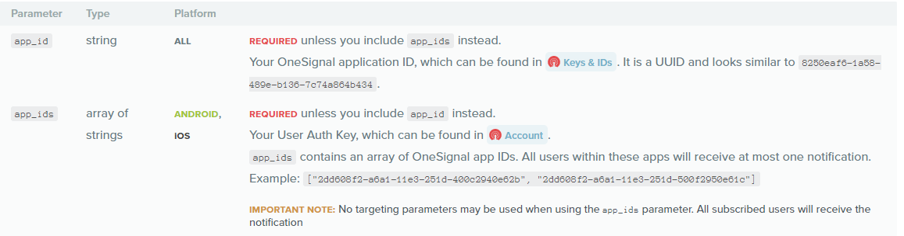

# OneSignal

OneSignal 暴露了许多REST API，只要拿到对应的appId，通过简单的http请求就能向集成OneSignal推送的目标设备发起推送。不仅如果，各种与其平台相关的操作都有API。


实现https请求有许多方式，各个语言也是各显神通。Onesignal十分友好的提供了各语言的简单实现，满足各种情况的推送需求。


# 请求结构

  OneSignal 发送推送 API 需要Post json数据到 **<https://onesignal.com/api/v1/notifications>**

  请求头部信息：

-   Content-Type: application/json; charset=utf-8
-   Authorization: Basic XXX（授权码）

    授权码，我瞎写了一个也能跑的通。暂不知道为什么

# 请求体

  请求体是封装好相应所需参数的json字符串。以下为相应所需参数。

-   app_id 或者 app_ids（推送多个app） 是必须的，但别两个都发



| key                | 说明    | 数据结构          | example                                            |
| ------------------ | ----- | ------------- | -------------------------------------------------- |
| contents           | 推送内容  | 对象            | {"en": "English Message", "es": "Spanish Message"} |
| headings           | 推送标题  | 对象            | {"en": "English Title", "es": "Spanish Title"}     |
| subtitle           | 推送子标题 | 对象(仅ios 10+)  | {"en": "English Title", "es": "Spanish Title"}     |
| big_picture        | 推送大图  | 字符串(仅android) | "big_picture.png"                                  |
| data               | 携带的数据 | 自定义           | 自己协定好的格式，取到后能正常解析就行                                |
| include_player_ids | 推送的设备 | 数组            | ["AAA","BBB"]                                      |

推送设备id是Onesignal给设备生成的UUID，类似这样的：6392d91a-b206-4b7b-a620-cd68e32c3a7x

# Python 实现

前文说到onesignal提供了许多实现，下文就是代码。

```python
# -*- coding: UTF-8 -*-
import requests
import json

'''
pushJsonStr 为推送的准备 json

app_id  = 就是应用id 改成自己项目的
REST_API_KEY = 是授权账号的 api key
include_player_ids = 要被推送的用户，list，可以写入多个账号

list 是你要推送的内容数据，这里写成了个列表，可以加入多个推送内容，一次性推送多个。里面的data是我们协定的、可处理的格式
'''
pushJsonStr = '''{
    "app_id": "xxxxxxx-1ac1-4cb5-8585-xxxxxxxxxx",
    "REST_API_KEY": "XXXXXXXXXjYtM2JjZC00NDgyLTk2ZDQtYjY5NmXXXXXXXXX",
    "include_player_ids": ["c608501f-5af5-4d08-bc3f-bd025af3a946"],
    "list": [
        {
            "headings": {"en": "English Title", "es": "Spanish Title"},
            "subtitle": {"en": "English Subtitle", "es": "Spanish Subtitle"},
            "contents": {"en": "English Message", "es": "Spanish Message"},
            "big_picture": "http://img5.imgtn.bdimg.com/it/u=3087789860,3276852373&fm=27&gp=0.jpg",
            "data": {"t": "flashdeals", "p": ""}
        },
        {
            "headings": {"en": "English Title2", "es": "Spanish Title"},
            "subtitle": {"en": "English Subtitle2", "es": "Spanish Subtitle"},
            "contents": {"en": "English Message2", "es": "Spanish Message"},
            "data": {"t": "flashdeals", "p": ""}
        }
    ]
}'''

# 把json串加载成字典
jsonDirt = json.loads(pushJsonStr)
print(type(jsonDirt))

header = {"Content-Type": "application/json; charset=utf-8",
          "Authorization": "Basic " + jsonDirt['REST_API_KEY']}

# 代理，调试查看请求用，调通就不需要了
proxies = {
    'http': '127.0.0.1:8899',
    'https': '127.0.0.1:8899',
}

# 遍历 json字典的 push 内容
for x in jsonDirt['list']:

    #  加入 app_id
    x['app_id'] = jsonDirt['app_id']
    # 加入需要推送的 设备id
    x['include_player_ids'] = jsonDirt['include_player_ids']
    # 开始推送
    print('-' * 50)
    print('【发出推送请求】: ' + json.dumps(x))
    req = requests.post("https://onesignal.com/api/v1/notifications",
                        headers=header,  data=json.dumps(x))
    print('\n')
    print('【收到推送响应Code】: ' + str(req.status_code) + ' ' + req.reason)
    print('【收到推送响应体】: ' + req.text)
    print('-' * 50 + '\n')
```

把上面的代码 复制到 **push.py** 里，修改成你想要的推送内容。 在终端输入命令 就可以跑了(python3 环境自备)

```
python3 push.py
```

如果终端打印出 200 就可以了，注意 响应体里面的 **recipients** 它标识着被推送的用户数，正常就个位数，

如果不是 那问题就严重了，所以一定要小心，先抓包验证没问题 再推。


