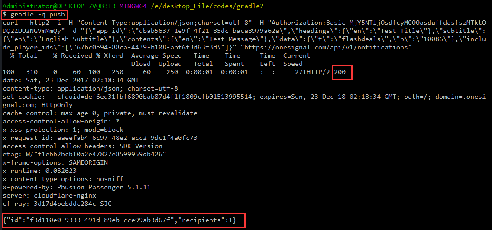
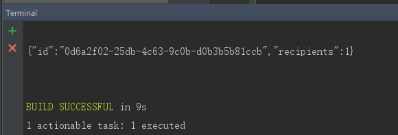

# OneSignal

OneSignal 暴露了许多REST API，只要拿到对应的appId，通过简单的http请求就能向集成OneSignal推送的目标设备发起推送。不仅如果，各种与其平台相关的操作都有API。


实现https请求有许多方式，各个语言也是各显神通。Onesignal十分友好的提供了各语言的简单实现，满足各种情况的推送需求。


# 请求结构

  OneSignal 发送推送 API 需要Post json数据到 **<https://onesignal.com/api/v1/notifications>**

  请求头部信息：

-   Content-Type: application/json; charset=utf-8
-   Authorization: Basic XXX（授权码）

    授权码，我瞎写了一个也能跑的通。暂不知道为什么

# 请求体

  请求体是封装好相应所需参数的json字符串。以下为相应所需参数。

-   app_id 或者 app_ids（推送多个app） 是必须的，但别两个都发


| key                | 说明    | 数据结构          | example                                            |
| ------------------ | ----- | ------------- | -------------------------------------------------- |
| contents           | 推送内容  | 对象            | {"en": "English Message", "es": "Spanish Message"} |
| headings           | 推送标题  | 对象            | {"en": "English Title", "es": "Spanish Title"}     |
| subtitle           | 推送子标题 | 对象(仅ios 10+)  | {"en": "English Title", "es": "Spanish Title"}     |
| big_picture        | 推送大图  | 字符串(仅android) | "big_picture.png"                                  |
| data               | 携带的数据 | 自定义           | 自己协定好的格式，取到后能正常解析就行                                |
| include_player_ids | 推送的设备 | 数组            | ["AAA","BBB"]                                      |

推送设备id是Onesignal给设备生成的UUID，类似这样的：6392d91a-b206-4b7b-a620-cd68e32c3a76

# gradle 实现

前文说到onesignal提供了许多实现，为了实现gradle脚本任务发起Http推送请求，果断选择了curl，光说有什么用，上代码呀。

```c
import groovy.json.JsonOutput

task push(type:Exec) {

    // App id ,很重要 望谨慎
    def appId = "xxxxxxxx-xxxx-xxxx-xxxx-xxxxxxxx"
    def REST_API_KEY = "MjY5NTljOsdfcyMC00asdaffdasfszMTktODQ2ZDU2NGVmMmQy"
    // 测试设备OneSignal Id
    def playerIds = ["67bc0e94-88ca-4439-b108-abf6f3d63f3d"]

    // 推送的标题 {"en": "English Title", "es": "Spanish Title"}
    def title = [en: "Test Title"]

    // 推送的内容 {"en": "English Message", "es": "Spanish Message"}
    def content = [en: "Test Message"]

    // 推送的子标题 iOS 10+  {"en": "English Subtitle", "es": "Spanish Subtitle"}
    def subtitle = [en: "English Subtitle"]

    // 各端协定好的携带的数据
    def data = [t:"flashdeals",p:"10086"]

    // 目标地址
    def targetUrl = "\"https://onesignal.com/api/v1/notifications\""

    def shell = ["curl"]
    shell.add("-v")
    shell.add("--http2")
    shell.add("-i")
    shell.add("-H \"Content-Type:application/json;charset=utf-8\"")
    shell.add("-H \"Authorization:Basic " + REST_API_KEY +"\"")

    // map封装json
    def map = ["app_id": appId]
    map.put("headings", title)
    map.put("subtitle", subtitle)
    map.put("contents", content)
    map.put("data", data)
    map.put("include_player_ids", playerIds)

    shell.add("-d \"" + JsonOutput.toJson(map).replaceAll("\"","\\\\\"")+"\"")

    shell.add(targetUrl)
    def curlStr=""
    for(i in shell){
        curlStr += i + " "
    }
    println curlStr
    if (System.properties['os.name'].contains('windows')){
      commandLine 'cmd', '/c', curlStr
    } else {
      commandLine curlStr
    }
}
```

最后一行，根据使用的操作系统会有差异。

```java
task stopTomcat(type:Exec) {
  workingDir '../tomcat/bin'

  //on windows:
  commandLine 'cmd', '/c', 'stop.bat'

  //on linux
  commandLine './stop.sh'
}
```

在当前目录打开终端命令行，输入命令 gradle push，



一切正常会收到推送id（可以用来取消刚才的推送）和影响的设备数。

上文的curl，如果测试正常，可以去除 -v 和 -i

再本地测试ok后，可酌情把代码放入项目中，在笔者的android studio开发环境是携带一个终端的，我就可以直接在开发环境就能调起推送测试



# 进阶

> 当我完成这一系列操作后，打算上传代码时。发现需求还要求把这个task做成工具，其他人只要引用就可以跑。在我一脸懵逼，抽个烟后冷静后。又开始了哒哒哒。

在仔细阅读完需求后，感觉还是合情合理的，不可能我推送一次改一次。一次性把所有支持的推送格式都推出去，然后慢慢测。

然后duang的一下，我就想到了解决方案。

我可以这样，让引用我这个Task的人先把请求数据结构按我想要的结构写好、放好，然后当他调用我任务时，我就去读取规定好的变量的值，然后把这些值处理后继续我的Curl 发推送。

规定以json格式放在项目gradle文件里的 push_test_json里，写入如下必要的参数。list数组的里面编写推送内容。

```c
ext {
    push_test_json = '''
{
    "app_id": "xxxxxx-xxxx-xxxx-xxxxx-xxxxxxxxx",
    "REST_API_KEY": "XXXXXXXXXXXXXXXXXXXXXy",
    "playerIds": ["67bc0e94-88ca-4439-b108-abf6f3d63f3d"],
    "list": [
        {
            "headings": {"en": "English Title", "es": "Spanish Title"},
            "subtitle": {"en": "English Subtitle", "es": "Spanish Subtitle"},
            "contents": {"en": "English Message", "es": "Spanish Message"},
            "big_picture":"big_picture",
            "data": {"t":"flashdeals","p":"1111111"},
        },
        {
            "headings": {"en": "English Title2", "es": "Spanish Title"},
            "subtitle": {"en": "English Subtitle2", "es": "Spanish Subtitle"},
            "contents": {"en": "English Message2", "es": "Spanish Message"},
            "data": {"t":"flashdeals","p":"22222222"}
        }
    ]
}
'''
}

task push {
    doLast {
        // 目标地址
        def targetUrl = "\"https://onesignal.com/api/v1/notifications\""

        def jsonSlurper = new JsonSlurper()
        Object rootJson = jsonSlurper.parseText(rootProject.push_test_json)

        // 遍历要发送的推送
        rootJson.list.each {
            def shell = ["curl"]
            shell.add("--http2")
            shell.add("-H \"Content-Type:application/json;charset=utf-8\"")
            shell.add("-H \"Authorization:Basic " + rootJson.REST_API_KEY + "\"")

            def map = ["app_id": rootJson.app_id]
            map.put("headings", it.headings)
            map.put("subtitle", it.subtitle)
            map.put("contents", it.contents)
            map.put("big_picture", it.big_picture)
            map.put("data", it.data)
            map.put("include_player_ids", rootJson.playerIds)

            shell.add("-d \"" + JsonOutput.toJson(map).replaceAll("\"", "\\\\\"") + "\"")

            shell.add(targetUrl)
            def curlStr = ""
            for (i in shell) {
                curlStr += i + " "
            }

            def outPut = new ByteArrayOutputStream()
            println "\n发送请求: \n" + curlStr
            exec {
                commandLine 'cmd', '/c', curlStr
                standardOutput = outPut
            }
            println "\n收到Onesignal响应: " + outPut.toString()
        }
    }
}
```

同样，在终端输入命令 就能发出推送了。


