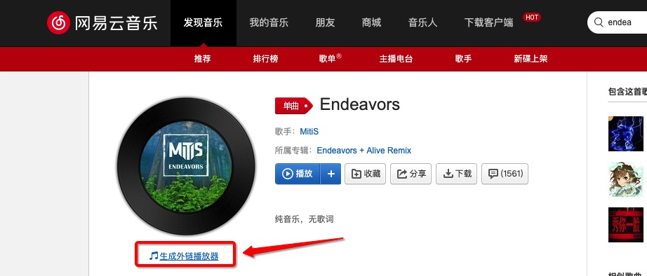
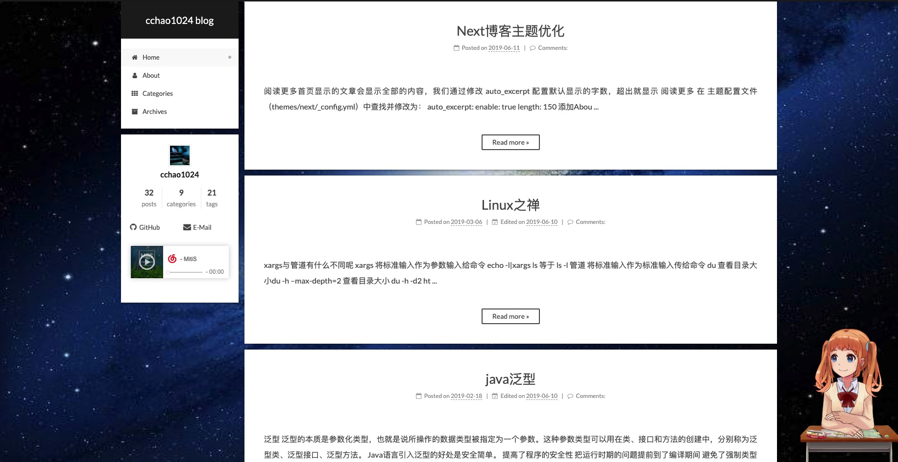

# 阅读更多

首页显示的文章会显示全部的内容，我们通过修改 **auto_excerpt** 配置默认显示的字数，超出就显示 **阅读更多**

在 **主题配置文件（themes/next/_config.yml）**中查找并修改为：

```c
auto_excerpt:
  enable: true
  length: 150
```

# 添加About

1 创建about页

```
hexo new page "about"
```

执行完成会生成 **source/about** 及**index.md** 文件，通过

2 编辑 index.md 文件展示个人信息

3 在 **主题配置文件（themes/next/_config.yml）** 中查找并取消 **menu下的about注释**

```
menu:
  home: / || home
  about: /about/ || user
  #tags: /tags/ || tags
  categories: /categories/ || th
  archives: /archives/ || archive
  #schedule: /schedule/ || calendar
  #sitemap: /sitemap.xml || sitemap
  #commonweal: /404/ || heartbeat
```


# 网易云音乐

1 前往[网易云音乐](<https://music.163.com/>)找到自己希望的背景音乐，点击**生成外链播放器** 

2 进入预览页，复制内嵌代码


3 进入目录 **themes/next/layout/_custom**，编辑文件 **sidebar.swig** 放入复制的内嵌代码

```
<!--网易云音乐-->
<div id="music163player">
    <iframe frameborder="no" border="0" marginwidth="0" marginheight="0" width=330 height=86 src="//music.163.com/outchain/player?type=2&id=36664503&auto=1&height=66"></iframe>
</div>
```


# 添加背景图

去找一张自己喜欢的背景图命名为 background.jpg

1 将背景图放入目录 **/themes/next/source/images** 下

2 进入目录 themes/next/source/css/_custom，编辑文件 **custom.styl**

// Custom styles.
 body {
​    background-image:url(/images/background.jpg);
​    background-repeat: no-repeat;
​    background-attachment:fixed;
​    background-position:50% 50%;
​	background-size: 100% 100%;
​    }


# 添加萌妹


1 安装module

```
npm install --save hexo-helper-live2d
```

2 在 **主题配置文件（themes/next/_config.yml）**新增

```
live2d:
  enable: true
  scriptFrom: local
  pluginRootPath: live2dw/
  pluginJsPath: lib/
  pluginModelPath: assets/
  tagMode: false
  log: false
  model:
    use: live2d-widget-model-wanko
  display:
    position: right
    width: 150
    height: 300
  mobile:
    show: true
  react:
    opacity: 0.7
```




# 字数统计，阅读时长


1. 安装 hexo-symbols-count-time
     `npm install hexo-symbols-count-time`
2. theme/_config.yaml 下 **新增** 配置

   ```
   symbols_count_time:
    symbols: true # 文章字数
    time: true # 阅读时长
    total_symbols: true # 所有文章总字数
    total_time: true # 所有文章阅读中时长
   ```

3. theme/next/_config.yaml 下 **修改** 配置

   ```
   symbols_count_time:
     separated_meta: true  # 是否换行显示 字数统计 及 阅读时长
     item_text_post: true  # 文章 字数统计 阅读时长 使用图标 还是 文本表示
     item_text_total: false # 博客底部统计 字数统计 阅读时长 使用图标 还是 文本表示
     awl: 4
     wpm: 275
   ```

4. 重启  hexo

# 阅读进度


修改 theme/next/_config.yaml

```yaml
back2top:
  enable: true
  # Back to top in sidebar.
  sidebar: true
  # Scroll percent label in b2t button.
  scrollpercent: true
```

# 右上角 github 地址

在 themes/next/layout/_layout.swig 查找到 `<div class="headband">`  div 节点，放入 期望的图片 [这里有很多样式](http://tholman.com/github-corners/) 复制一个 放进去

# 顶部加载进度条
[https://github.com/theme-next/theme-next-pace](https://github.com/theme-next/theme-next-pace)
clone 完成后，在 _config.yml 中 设置
`pace: true` 启用
# 代码块复制

[代码块复制功能](<https://yfzhou.coding.me/2018/08/27/Hexo-Next%E6%90%AD%E5%BB%BA%E4%B8%AA%E4%BA%BA%E5%8D%9A%E5%AE%A2%EF%BC%88%E4%BB%A3%E7%A0%81%E5%9D%97%E5%A4%8D%E5%88%B6%E5%8A%9F%E8%83%BD%EF%BC%89/>)

# Referer

[https://github.com/EYHN/hexo-helper-live2d](https://github.com/EYHN/hexo-helper-live2d)

[https://hexo.io/zh-cn/docs/](https://hexo.io/zh-cn/docs/)

[hexo-theme-next](https://github.com/theme-next/hexo-theme-next)