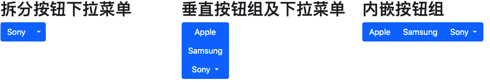

# 基础页面

```html
<!DOCTYPE html>
<html>
<head>
    <meta charset="utf-8"> 
    <meta name="viewport" content="width=device-width, initial-scale=1, shrink-to-fit=no">
    <link rel="stylesheet" href="https://cdn.bootcss.com/bootstrap/4.1.0/css/bootstrap.min.css">
    <script src="https://cdn.bootcss.com/jquery/3.2.1/jquery.min.js"></script>
    <script src="https://cdn.bootcss.com/popper.js/1.12.5/umd/popper.min.js"></script>
    <script src="https://cdn.bootcss.com/bootstrap/4.1.0/js/bootstrap.min.js"></script>
</head>
<body>
<div class="container">
    <h1>我的第一个 Bootstrap 页面</h1>
    <p>这是一些文本。</p>
</div>
</body>
</html>
```


# 网格系统

Bootstrap 4 网格系统是基于 **12列** 的布局，内容需要放置在列中，并且只有列可以是行的直接子节点。

有以下 5 个类，针对不同的分辨率有不同的列占用

1、col- 针对所有设备

2、col-sm- 平板 - 屏幕宽度等于或大于 576px

3、col-md- 桌面显示器 - 屏幕宽度等于或大于 768px

4、col-lg- 大桌面显示器 - 屏幕宽度等于或大于 992px

5、col-xl- 超大桌面显示器 - 屏幕宽度等于或大于 1200px

```html
<div class="row">
  <div class="col-*-*"></div>
  <div class="col-*-*"></div>
  <div class="col-*-*"></div>
</div>
```

`col-*-*` 第一个 * 表示设备，第二个 * 表示占据的列， 同一行内的列相加等于12，如：`col-md-6`

```html
<div class="container-fluid">
  <p> 平板、桌面、大桌面显示器、超大桌面显示器的宽度比例为分别为：
        3:9、5:5、3:6、2:10 
      在移动手机等小型设备上会堆叠显示。</p>
  <p>重置浏览器窗口大小，查看效果。</p>
  <div class="container-fluid">
    <div class="row">
      <div class="col-sm-3 col-md-6 col-lg-4 col-xl-2 bg-success">
        W3Cschool
      </div>
      <div class="col-sm-9 col-md-6 col-lg-8 col-xl-10 bg-warning">
        学编程，上W3Cschool
      </div>
    </div>
  </div>
</div>
```

## 偏移列


通过`offset-*-* `来设置 如：.offset-md-4 是把 .col-md-4 往右移了四列格


# 排版样式

Bootstrap4 采用了一些简单易用的自定义排版元素，让用户可以对标题、正文、表格等等能够自由定义。

- `class="display-1"` ， display显示 **更大更粗** 的字体样式
- `<small>更小</small>`
- `<mark>高亮</mark>`
- `class="blockquote"` 引用样式 
- `<code>java</code>`  代码样式
- `<kbd>ctrl + p</kbd>`   指示通过键盘输入


更多样式

| **类名**            | **描述**                                                     |
| ------------------- | :----------------------------------------------------------- |
| .font-weight-bold   | 加粗文本                                                     |
| .font-weight-normal | 普通文本                                                     |
| .font-weight-light  | 更细的文本                                                   |
| .font-italic        | 斜体文本                                                     |
| .lead               | 让段落更突出                                                 |
| .small              | 指定更小文本 (为父元素的 85% )                               |
| .text-left          | 左对齐                                                       |
| .text-center        | 居中                                                         |
| .text-right         | 右对齐                                                       |
| .text-justify       | 设定文本对齐,段落中超出屏幕部分文字自动换行                  |
| .text-nowrap        | 段落中超出屏幕部分不换行                                     |
| .text-lowercase     | 设定文本小写                                                 |
| .text-uppercase     | 设定文本大写                                                 |
| .text-capitalize    | 设定单词首字母大写                                           |
| .initialism         | 显示在 <abbr> 元素中的文本以小号字体展示，且可以将小写字母转换为大写字母 |
| .list-unstyled      | 移除默认的列表样式，列表项中左对齐 ( <ul> 和 <ol> 中)。 这个类仅适用于直接子列表项 (如果需要移除嵌套的列表项，你需要在嵌套的列表中使用该样式) |
| .list-inline        | 将所有列表项放置同一行                                       |
| .pre-scrollable     | 使 <pre> 元素可滚动，代码块区域最大高度为340px,一旦超出这个高度,就会在Y轴出现滚动条 |

```html
<div class="container">

    <p class="display-1">Display 1</p>
    <abbr title="World Health Organization">WHO</abbr>
    <blockquote class="blockquote">
        <p>For 50 years, WWF has been protecting the future of nature. The world's leading conservation organization, WWF works in 100 countries and is supported by 1.2 million members in the United States and close to 5 million globally.</p>
        <footer class="blockquote-footer">From WWF's website</footer>
    </blockquote>

    <code>section</code>
    <p>Use <kbd>ctrl + p</kbd> to open the Print dialog box.</p>
    <pre>
Text in a pre element
is displayed in a fixed-width
font, and it preserves
both      spaces and
line breaks.
    </pre>
</div>
    
```


# 颜色 背景

Bootstrap4 提供了一些有代表意义的颜色类，如：

```html
<div class="container">
  <h2>代表指定意义的文本颜色</h2>
  <p class="text-muted">柔和的文本。</p>
  <p class="text-primary">重要的文本。</p>
  <p class="text-success">执行成功的文本。</p>
  <p class="text-info">代表一些提示信息的文本。</p>
  <p class="text-warning">警告文本。</p>
  <p class="text-danger">危险操作文本。</p>
  <p class="text-secondary">副标题。</p>
  <p class="text-dark">深灰色文字。</p>
  <p class="text-light">浅灰色文本（白色背景上看不清楚）。</p>
  <p class="text-white">白色文本（白色背景上看不清楚）。</p>
</div>
```

还有背景颜色

```html
<div class="container">
  <h2>背景颜色</h2>
  <p class="bg-primary text-white">重要的背景颜色。</p>
  <p class="bg-success text-white">执行成功背景颜色。</p>
  <p class="bg-info text-white">信息提示背景颜色。</p>
  <p class="bg-warning text-white">警告背景颜色</p>
  <p class="bg-danger text-white">危险背景颜色。</p>
  <p class="bg-secondary text-white">副标题背景颜色。</p>
  <p class="bg-dark text-white">深灰背景颜色。</p>
  <p class="bg-light text-dark">浅灰背景颜色。</p>
</div>
```


# 表格

通过 `class="table"` 来设置表格样式
```html
<p>通过添加 .table-striped 类，来设置条纹表格:</p>            
<p>.table-bordered 类可以为表格添加边框:</p>            
<p>.table-hover 类可以为表格的每一行添加鼠标悬停效果（灰色背景）：</p>            
<p>.table-dark 类可以为表格添加黑色背景：</p>            
<table class="table table-striped table-bordered table-hover table-dark ">

<p>.table-sm 类用于通过减少内边距来设置较小的表格:</p>            
<table class="table table-bordered table-sm">
  
<p>.table-responsive 类用于创建响应式表格：在屏幕宽度小于 992px 时会创建水平滚动条，如果可视区域宽度大于 992px 则显示不同效果（没有滚动条）:
  通过 `.table-responsive-sm` 设置指定 滚动条                                                                                       
<div class="table-responsive">          
<table class="table">
```

通过 `<tr class="table-active">` 来指定意义的颜色类可以为表格的行或者单元格设置颜色

| 类名             | 描述                             |
| ---------------- | -------------------------------- |
| .table-primary   | 蓝色: 指定这是一个重要的操作     |
| .table-success   | 绿色: 指定这是一个允许执行的操作 |
| .table-danger    | 红色: 指定这是可以危险的操作     |
| .table-info      | 浅蓝色: 表示内容已变更           |
| .table-warning   | 橘色: 表示需要注意的操作         |
| .table-active    | 灰色: 用于鼠标悬停效果           |
| .table-secondary | 灰色: 表示内容不怎么重要         |
| .table-light     | 浅灰色，可以是表格行的背景       |
| .table-dark      | 深灰色，可以是表格行的背景       |


# 图片

```

rounded：让图片显示圆角效果
rounded-circle：设置椭圆形图片
img-thumbnail：图片缩略图(图片有边框)
float-right 图片右对齐
float-left 图片左对齐
img-fluid 响应式图片。


```


# 提示框

# Button

```html
<div class="container">
    <h2>按钮样式</h2>
    <button type="button" class="btn">基本按钮</button>
    <button type="button" class="btn btn-primary">主要按钮</button>
    <button type="button" class="btn btn-secondary">次要按钮</button>
    <button type="button" class="btn btn-success">成功</button>
    <button type="button" class="btn btn-info">信息</button>
    <button type="button" class="btn btn-warning">警告</button>
    <button type="button" class="btn btn-danger">危险</button>
    <button type="button" class="btn btn-dark">黑色</button>
    <button type="button" class="btn btn-light">浅色</button>
    <button type="button" class="btn btn-link">链接</button>
</div>
```

按钮类可用于` <a>, <button> ` 或 ` <input>` 元素上:

通过添加  `btn-outline-[样式]`显示细边框按钮，如：

`btn-outline-primary`，`btn-outline-secondary`

其他 相关样式

- `class="btn-lg"`  大按钮
- `class="btn-sm"` 小按钮
- `class="disabled"` 禁止点击
- `class="active"` 点击后的样式
- `class="btn-block"` 块级按钮(全屏长度按钮)


## 按钮组

我们可以在 `<div>` 元素上添加 `.btn-group` 类来创建按钮组

`.btn-group-lg、btn-group-sm、btn-group-xs`类来设置按钮组的大小。

`.btn-group-vertical` 类来创建垂直的按钮组：

```
<div class="container">
    <h2>内嵌按钮组</h2>
    <p>按钮组设置下拉菜单:</p>
    <div class="btn-group">
        <button type="button" class="btn btn-primary">Apple</button>
        <button type="button" class="btn btn-primary">Samsung</button>
        <div class="btn-group">
            <button type="button" class="btn btn-primary dropdown-toggle" data-toggle="dropdown">
                Sony
            </button>
            <div class="dropdown-menu">
                <a class="dropdown-item" href="#">Tablet</a>
                <a class="dropdown-item" href="#">Smartphone</a>
            </div>
        </div>
    </div>
</div>
```




# badge 徽章
和 其他样式一样，徽章也有 不同样色类型，如：`badge-primary, badge-success` 等
使用 `.badge-pill` 类来设置药丸形状徽章

```html

<div class="container">
    <h2>徽章嵌入到按钮内</h2>
    <button type="button" class="btn btn-primary">
        Messages <span class="badge badge-pill badge-info">4</span>
    </button>
    <button type="button" class="btn btn-danger">
        Notifications <span class="badge badge-light">7</span>
    </button>
</div>
```

 

# 进度条

使用 CSS 的 height 属性来对高度进行修改
可以在进度条内添加文本
添加颜色类修改来对进度条的颜色
使用 `.progress-bar-striped` 类来改变进度条成条纹样式
使用 `.progress-bar-animated` 类为进度条添加动画
还可以混合进度条颜色

```html
<div class="container">
  <h2>基本进度条</h2>
  <p>要创建一个默认的进度条，可以在容器元素上添加 .progress 类，在子元素上添加 progress-bar 类，并设置进度条进度情况：:</p>
  <div class="progress">
    <div class="progress-bar progress-bar-animated progress-bar-striped" style="width:70%;height: 16px">70%</div>
  </div>
</div>
```


# 分页

要创建一个基本的分页可以在 `<ul>` 元素上添加 `.pagination` 类。然后在 `<li>` 元素上添加 `.page-item` 类
`pagination-lg` 类设置大字体的分页条目
`pagination-sm` 类设置小字体的分页条目
`active` 类来高亮显示 `disable` 不可点

```html
<div class="container">
    <ul class="pagination">
        <li class="page-item"><a class="page-link" href="#">Previous</a></li>
        <li class="page-item"><a class="page-link" href="#">1</a></li>
        <li class="page-item"><a class="page-link" href="#">2</a></li>
        <li class="page-item active"><a class="page-link " href="#">3</a></li>
        <li class="page-item disabled"><a class="page-link " href="#">Next</a></li>
    </ul>
</div>
<div class="container">
    <p>面包屑导航 .breadcrumb 和 .breadcrumb-item 类用于设置面包屑导航：</p>
    <ul class="breadcrumb">
        <li class="breadcrumb-item"><a href="#">Photos</a></li>
        <li class="breadcrumb-item"><a href="#">Summer 2017</a></li>
        <li class="breadcrumb-item active">Rome</li>
    </ul>
</div>
```


# 列表组

列表组是显示元素列表用的，可以通过 `ul包裹li`  或者`div包裹a`上设置 `list-group`，`list-group-item` 进行编入列表，

可以添加 `active` ，`disable` 标识，

`list-group-item`  可以单独存在（也就是应用了样式的普通元素），可以添加 不同样色，如： list-group-item-success

```html
<div class="container">
    <h2>多种颜色列表项</h2>
    <div class="list-group">
        <a href="#" class="list-group-item list-group-item-action active">激活列表项</a>
        <a href="#" class="list-group-item list-group-item-success">成功列表项</a>
        <a href="#" class="list-group-item list-group-item-secondary disabled">次要列表项</a>
        <a href="#" class="list-group-item list-group-item-info">信息列表项</a>
    </div>
</div>
```


# 卡片

包含了可选的卡片头和卡片脚、一个大范围的内容、上下文背景色以及显示选项。
`card` 与 `card-body` 类来创建卡片
`card-title` 设置标题，`card-text` 设置正文 
`card-header`和`card-footer` 显示卡片头尾
通过 `bg-success` 等颜色 设置卡片背景色
给 `` 添加 `card-img-top`（图片在文字上方） 或 `card-img-bottom`（图片在文字下方 来设置图片卡片，`card-img-overlay` 设置图片背景

```html
<div class="container">
    <h2>文字覆盖图片</h2>
    <p>如果图片要设置为背景，可以使用 .card-img-overlay 类:</p>
    <div class="card img-fluid" style="width:400px;">
        
        <div class="card-img-overlay">
            <h4 class="card-title">W3Cschool</h4>
            <p class="card-text">Some example text.</p>
            <a href="#" class="btn btn-primary">See Profile</a>
        </div>
    </div>
</div>
```


# 下拉菜单

`dropdown` 类用来指定一个下拉菜单。`dropup` 向上弹出

我们可以使用一个按钮或链接来打开下拉菜单， 按钮或链接需要添加 `dropdown-toggle` 和 `data-toggle="dropdown"` 属性。

`<div>` 元素上添加 `dropdown-menu` 类来设置实际下拉菜单，然后在下拉菜单的选项中添加 `dropdown-item` 类

`dropdown-divider` 类用于在下拉菜单中创建一个水平的分割线：
`dropdown-header` 类用于在下拉菜单中添加标题
`dropdown-menu-right` 右对齐
支持 `active, disable`

```html
<div class="dropdown">
	<button type="button" class="btn dropdown-toggle" id="dropdownMenu1" 
			data-toggle="dropdown">
		主题
		<span class="caret"></span>
	</button>
	<ul class="dropdown-menu" role="menu" aria-labelledby="dropdownMenu1">
		<li role="presentation" class="dropdown-header">下拉菜单标题</li>
		<li role="presentation" >
			<a role="menuitem" tabindex="-1" href="#">Java</a>
		</li>
		<li role="presentation">
			<a role="menuitem" tabindex="-1" href="#">数据挖掘</a>
		</li>
		<li role="presentation">
			<a role="menuitem" tabindex="-1" href="#">
				数据通信/网络
			</a>
		</li>
		<li role="presentation" class="divider"></li>
		<li role="presentation" class="dropdown-header">下拉菜单标题</li>
		<li role="presentation">
			<a role="menuitem" tabindex="-1" href="#">分离的链接</a>
		</li>
	</ul>
</div>
```

# 折叠板

`collapse` 类用于指定一个折叠元素 (如 `<div>`); 点击按钮后会在隐藏与显示之间切换。

控制内容的隐藏与显示，需要在 `<a>` 或 `<button>` 元素上添加 `data-toggle="collapse"` 属性。 `data-target="#id"` 属性是对应折叠的内容 (`<div id="demo">`)。

折叠的内容是默认隐藏的，我们可以通过添加 `show` 类让内容默认显示

**手风琴**  使用 data-parent 属性来确保所有的折叠元素在指定的父元素下，这样就能实现在一个折叠选项显示时其他选项就隐藏。

# Nav 导航

nav 配合 `ul, li` 实现导航样式，

- `class="nav nav-tabs"`  标签样式
- `class="nav nav-pills"`	胶囊式标签页	尝试一下
- `class="nav flex-column"` 垂直排列  
- `class="nav nav-pills nav-stacked"`	胶囊式标签页以垂直方向堆叠排列的	尝试一下
- `class="nav-justified"`	两端对齐的标签页，让标签呈现出同等宽度。在小屏幕上，导航链接呈现堆叠样式。
```html
<p>带有下拉菜单的胶囊</p>
  <ul class="nav nav-pills">
    <li class="active"><a href="#">Home</a></li>
    <li><a href="#">SVN</a></li>
    <li><a href="#">iOS</a></li>
    <li><a href="#">VB.Net</a></li>
    <li class="dropdown">
      <a class="dropdown-toggle" data-toggle="dropdown" href="#">
        Java <span class="caret"></span>
      </a>
      <ul class="dropdown-menu">
        <li><a href="#">Swing</a></li>
        <li><a href="#">jMeter</a></li>
        <li><a href="#">EJB</a></li>
        <li class="divider"></li>
        <li><a href="#">分离的链接</a></li>
      </ul>
    </li>
    <li><a href="#">PHP</a></li>
  </ul>
```


```html
<div class="container">
    <h2>胶囊选项卡切换</h2>
    <br>
    <!-- Nav pills -->
    <ul class="nav nav-pills" role="tablist">
        <li class="nav-item">
            <a class="nav-link active" data-toggle="pill" href="#home">Home</a>
        </li>
        <li class="nav-item">
            <a class="nav-link" data-toggle="pill" href="#menu1">Menu 1</a>
        </li>
        <li class="nav-item">
            <a class="nav-link" data-toggle="pill" href="#menu2">Menu 2</a>
        </li>
    </ul>
    <!-- Tab panes -->
    <div class="tab-content">
        <div id="home" class="container tab-pane active"><br>
            <h3>HOME</h3>
            <p>Lorem ipsum dolor sit amet, consectetur adipisicing elit, sed do eiusmod tempor incididunt ut labore et dolore magna aliqua.</p>
        </div>
        <div id="menu1" class="container tab-pane fade"><br>
            <h3>Menu 1</h3>
            <p>Ut enim ad minim veniam, quis nostrud exercitation ullamco laboris nisi ut aliquip ex ea commodo consequat.</p>
        </div>
        <div id="menu2" class="container tab-pane fade"><br>
            <h3>Menu 2</h3>
            <p>Sed ut perspiciatis unde omnis iste natus error sit voluptatem accusantium doloremque laudantium, totam rem aperiam.</p>
        </div>
    </div>
</div>
```

## 导航栏

我们可以使用 `navbar` 类来创建一个标准的导航栏，后面紧跟: `navbar-expand-xl|lg|md|sm` 类来创建响应式的导航栏 (大屏幕水平铺开，小屏幕垂直堆叠)。

导航栏上的选项可以使用 `<ul>` 元素并添加 `class="navbar-nav"` 类。 然后在 `<li>` 元素上添加 `nav-item` 类，`<a>` 元素上使用 `nav-link` 类:

[<https://www.runoob.com/bootstrap/bootstrap-navbar.html>](https://www.runoob.com/bootstrap/bootstrap-navbar.html)

# 表单

- 垂直表单（默认）
- 内联表单
- 水平表单

## 垂直
将标签和控件 放在 `form-group` div内
控件元素 添加 class="form-control"

```html
# 将标签和控件 放在 form-group div内
# 控件元素 添加 class="form-control"

<form role="form">
  <div class="form-group">
    <label for="name">名称</label>
    <input type="text" class="form-control" id="name" placeholder="请输入名称">
  </div>
  <div class="form-group">
    <label for="inputfile">文件输入</label>
    <input type="file" id="inputfile">
    <p class="help-block">这里是块级帮助文本的实例。</p>
  </div>
  <div class="checkbox">
    <label>
      <input type="checkbox">请打勾
    </label>
  </div>
  <button type="submit" class="btn btn-default">提交</button>
</form>
```


## 内联


需要 在 form 标签添加 `class="form-inline"` 

使用 `class *.sr-only*`，您可以隐藏内联表单的标签。

## 水平
向父 `<form>` 元素添加 `class ="form-horizontal"`。
将标签和控件 放在 `form-group` div内
标签元素 添加 `class="control-label"`

## 表单控件
###  input
    input 通过type 传入类型，值为 
text, password, datetime, datetime-local, date, month, time, week, number, email, url, search, tel, 以及 color。
`<input type="text" class="form-control" id="usr">`

### checkbox

```
<label for="name">默认的复选框和单选按钮的实例</label>
<div class="checkbox">
    <label><input type="checkbox" value="">选项 1</label>
</div>
<div class="checkbox">
    <label><input type="checkbox" value="">选项 2</label>
</div>
<div class="radio">
    <label>
        <input type="radio" name="optionsRadios" id="optionsRadios1" value="option1" checked> 选项 1
    </label>
</div>
<div class="radio">
    <label>
        <input type="radio" name="optionsRadios" id="optionsRadios2" value="option2">选项 2 - 选择它将会取消选择选项 1
    </label>
</div>
<label for="name">内联的复选框和单选按钮的实例</label>
<div>
    <label class="checkbox-inline">
        <input type="checkbox" id="inlineCheckbox1" value="option1"> 选项 1
    </label>
    <label class="checkbox-inline">
        <input type="checkbox" id="inlineCheckbox2" value="option2"> 选项 2
    </label>
    <label class="checkbox-inline">
        <input type="checkbox" id="inlineCheckbox3" value="option3"> 选项 3
    </label>
    <label class="radio-inline">
        <input type="radio" name="optionsRadiosinline" id="optionsRadios3" value="option1" checked> 选项 1
    </label>
    <label class="radio-inline">
        <input type="radio" name="optionsRadiosinline" id="optionsRadios4"  value="option2"> 选项 2
    </label>
</div>
```


...

# 轮播

外层div  `class="carousel slide"`

指示符ul  `class="carousel-indicators"`

轮播图div `class="carousel-inner"`

左右切换按钮 `class="carousel-control-prev"`  `class="carousel-control-next"`

- 属性 **data-slide** 接受关键字 *prev* 或 *next*，用来改变幻灯片相对于当前位置的位置。
- 使用 **data-slide-to** 来向轮播传递一个原始滑动索引，**data-slide-to="2"** 将把滑块移动到一个特定的索引，索引从 0 开始计数。
- **data-ride="carousel"** 属性用于标记轮播在页面加载时就开始动画播放。

```html
<div id="demo" class="carousel slide" data-ride="carousel">
  <!-- 指示符 -->
  <ul class="carousel-indicators">
    <li data-target="#demo" data-slide-to="0" class="active"></li>
    <li data-target="#demo" data-slide-to="1"></li>
    <li data-target="#demo" data-slide-to="2"></li>
  </ul>
  <!-- 轮播图片 -->
  <div class="carousel-inner">
    <div class="carousel-item active">
      
      <div class="carousel-caption">
        <h3>第一张图片描述标题</h3>
        <p>描述文字!</p>
      </div>
    </div>
    <div class="carousel-item">
      
      <div class="carousel-caption">
        <h3>第二张图片描述标题</h3>
        <p>描述文字!</p>
      </div>
    </div>
    <div class="carousel-item">
      
      <div class="carousel-caption">
        <h3>第三张图片描述标题</h3>
        <p>描述文字!</p>
      </div>
    </div>
  </div>
  <!-- 左右切换按钮 -->
  <a class="carousel-control-prev" href="#demo" data-slide="prev">
    <span class="carousel-control-prev-icon"></span>
  </a>
  <a class="carousel-control-next" href="#demo" data-slide="next">
    <span class="carousel-control-next-icon"></span>
  </a>
</div>
```


# 静态框

在控制器元素（比如按钮或者链接）上设置属性 **data-toggle="modal"**，设置 **data-target="#identifier"** 或 **href="#identifier"** 来指定要切换的特定的模态框（带有 id="identifier"）


- 使用模态窗口，您需要有某种触发器。您可以使用按钮或链接。这里我们使用的是按钮。
- 如果您仔细查看上面的代码，您会发现在 <button> 标签中，**data-target="#myModal"** 是您想要在页面上加载的模态框的目标。您可以在页面上创建多个模态框，然后为每个模态框创建不同的触发器。现在，很明显，您不能在同一时间加载多个模块，但您可以在页面上创建多个在不同时间进行加载。
- 在模态框中需要注意两点：
  1. 第一是 **.modal**，用来把 <div> 的内容识别为模态框。
  2. 第二是 **.fade** class。当模态框被切换时，它会引起内容淡入淡出。
- **aria-labelledby="myModalLabel"**，该属性引用模态框的标题。
- 属性 **aria-hidden="true"** 用于保持模态窗口不可见，直到触发器被触发为止（比如点击在相关的按钮上）。
- `<div class="modal-header">`，modal-header 是为模态窗口的头部定义样式的类。
- **class="close"**，close 是一个 CSS class，用于为模态窗口的关闭按钮设置样式。
- **data-dismiss="modal"**，是一个自定义的 HTML5 data 属性。在这里它被用于关闭模态窗口。
- **class="modal-body"**，是 Bootstrap CSS 的一个 CSS class，用于为模态窗口的主体设置样式。
- **class="modal-footer"**，是 Bootstrap CSS 的一个 CSS class，用于为模态窗口的底部设置样式。
- **data-toggle="modal"**，HTML5 自定义的 data 属性 data-toggle 用于打开模态窗口。

```html
<!-- 按钮触发模态框 -->
<button class="btn btn-primary btn-lg" data-toggle="modal" data-target="#myModal">开始演示模态框</button>
<!-- 模态框（Modal） -->
<div class="modal fade" id="myModal" tabindex="-1" role="dialog" aria-labelledby="myModalLabel" aria-hidden="true">
    <div class="modal-dialog">
        <div class="modal-content">
            <div class="modal-header">
                <button type="button" class="close" data-dismiss="modal" aria-hidden="true">&times;</button>
                <h4 class="modal-title" id="myModalLabel">模态框（Modal）标题</h4>
            </div>
            <div class="modal-body">在这里添加一些文本</div>
            <div class="modal-footer">
                <button type="button" class="btn btn-default" data-dismiss="modal">关闭</button>
                <button type="button" class="btn btn-primary">提交更改</button>
            </div>
        </div><!-- /.modal-content -->
    </div><!-- /.modal -->
```


# 提示样式

提示样式 通过`data-toggle`  控制，提示样式不是纯 CSS 插件。必须使用 jquery 激活它（读取 javascript）

```javascript
<script>
$(document).ready(function(){
    $('[data-toggle="tooltip"]').tooltip();   
});
</script>
```

- `data-trigger`展示形式  值：  **click| hover | focus | manual**
- `data-toggle`提示样式 值：**tooltip | popover**
- `data-placement` 显示位置  值：**top|bottom|left|right|auto**


## 提示工具

一个小小的弹窗，只有当鼠标移动到元素上时才会显示，鼠标移出后消失

`data-toggle="tooltip"`

```html
<div class="container">
  <h3>提示框实例</h3><br>
  <a href="#" data-toggle="tooltip" data-placement="top" title="我是提示内容!">鼠标移动到我这</a>
  <a href="#" data-toggle="tooltip" data-placement="bottom" title="我是提示内容!">鼠标移动到我这</a>
  <a href="#" data-toggle="tooltip" data-placement="left" title="我是提示内容!">鼠标移动到我这</a>
  <a href="#" data-toggle="tooltip" data-placement="right" title="我是提示内容!">鼠标移动到我这</a>
</div>
<script>
$(document).ready(function(){
    $('[data-toggle="tooltip"]').tooltip();   
});
</script>
```


## 弹出框

弹出框，鼠标点击后弹出

`data-toggle="popover"`

```html
<div class="container" style="padding: 100px 50px 10px;" >
    <button type="button" class="btn btn-default" title="Popover title"
            data-container="body" data-toggle="popover" data-placement="left"
            data-content="左侧的 Popover 中的一些内容">
        左侧的 Popover
    </button>
</div>
 
<script>
$(function (){
    $("[data-toggle='popover']").popover();
});
</script>
```

# 警告框
```html
<h3>警告框（Alert）插件 alert('close') 方法</h3>
<div id="myAlert" class="alert alert-success">
    <a href="#" class="close" data-dismiss="alert">&times;</a>
    <strong>成功！</strong>结果是成功的。
</div>
<div id="myAlert2" class="alert alert-warning">
    <a href="#" class="close" data-dismiss="alert">&times;</a>
    <strong>警告！</strong>您的网络连接有问题。
</div>
 
<script>
$(function(){
    $(".close").click(function(){
        $("#myAlert").alert('close');
        $("#myAlert2").alert('close');
    });
});

$(function(){
    $("#myAlert").bind('closed.bs.alert', function () {
        alert("监听到 警告消息框被关闭。");
    });
});
</script>
```

# 滚动监听
会根据滚动条的位置自动更新对应的导航目标。其基本的实现是随着您的滚动，基于滚动条的位置向导航栏添加 `active class`。

向想要监听的元素（通常是 body）添加 `data-spy="scroll"`。然后添加带有 `Bootstrap .nav` 组件的父元素的 ID 或 class 的属性 `data-target`

```html
<body data-spy="scroll" data-target=".navbar-example">
...
<div class="navbar-example">
    <ul class="nav nav-tabs">
        ...
    </ul>
</div>
...
</body>
```

# 其他
```html
<span class="border border-info">实现边框颜色</span>
  <span class="border border-0"></span>
  <span class="border border-top-0">使用 border 类可以添加或移除边框</span>
  
  <p>使用rounded 类可以添加圆角边框:</p> 
  <span class="rounded"></span><!--全部圆角-->
  <span class="rounded-top"></span><!--上方圆角-->
  
  <p>.float-right 类用于设置元素右浮动， .float-left 设置元素左浮动, .clearfix 类用于清除浮动:</p> 
  <div class="clearfix">
    <span class="float-left">左浮动</span>
    <span class="float-right">右浮动</span>
  </div>
  
  <p>我们看可以设置浮动 (.float-*-left|right - * 为 sm, md, lg 或 xl)的方向依赖于屏幕的大小:</p> 
  <div class="float-sm-right">在大于小屏幕尺寸上右浮动</div><br>
  <div class="float-md-right">在大于中等屏幕尺寸上右浮动</div><br>
  
  <p>使用 .mx-auto 类来设置居中对齐::</p>
  <div class="mx-auto bg-warning" style="width:150px">居中</div>
  
  <p>元素上使用 w-* 类 (.w-25, .w-50, .w-75, .w-100, .mw-100) 来设置宽度:</p>
  <div class="w-25 bg-warning">宽度 25%</div>
  <div class="w-50 bg-warning">宽度 50%</div>
  
  <p>元素上使用 h-* 类 (.h-25, .h-50, .h-75, .h-100, .mh-100) 来设置高度:</p>
  <div style="height:200px;background-color:#ddd">
    <div class="h-25 d-inline-block p-2 bg-warning">高度 25%</div>
    <div class="h-75 d-inline-block p-2 bg-warning">高度 75%</div>
    <div class="h-100 d-inline-block p-2 bg-warning">高度 100%</div>
    <div class="mh-100 d-inline-block p-2 bg-warning" style="height:500px">最大高度 100%</div>
  </div>
```