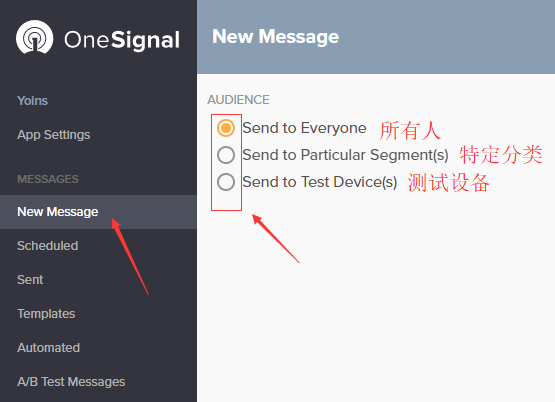

# 推送平台
#### GCM(Google Cloud Messaging)
gcm是google提供的一个免费推送服务,可以实现客户端和服务器之前的推送。（包括客服端推送消息到服务器或者服务器推送消息到客户端）

#### FCM(Firebase Cloud Messaging)
Firebase云消息传递是GCM的新版本。它继承了可靠和可扩展的GCM基础架构，以及新的功能！

使用 GCM/FCM，您可以通知客户端应用存在可同步的新电子邮件或其他数据。您可以发送通知消息以再次吸引用户并促进用户留存。在即时消息传递等使用情形中，一条消息可将最大 4KB 的有效负载传送至客户端应用。

#### OneSignal
OneSignal是提供针对网站和移动应用的高容量和可靠推送通知服务的平台。实现了GCM / FCM（Google），APNS（Apple）和Web Push协议的接口，具有细分市场定位，自动/触发的通知，变量替换，详细的推送报告工具等功能。

可以理解为 OneSignal是对GCM/FCM和APNS的功能拓展。

# 推送原理
我们知道，当我们推送后台编辑好推送内容后，消息就会送达到用户的设备，如果使用的是OneSignal还可以选择特定的用户分类去发送推送，那整个过程是怎么实现的，我们先了解推送平台是如何记住各个用户，以及划分用户类别的。

1. Android设备将设备信息和App ID发送到推送平台(FCM/OneSignal)服务器进行注册。
2. 注册成功后，推送平台会生成唯一的标识（firebase是token,OneSignal是设备ID）并记录下来，之后发送这个**唯一的标识**给App。
3. 收到唯一的标识后，App会将唯一的标识和用户信息发送到自己网站的服务器。（可选）
4. 网站的服务器将唯一的标识和用户信息绑定存储在数据库。（可选）

在完成上面过程后，app就会收集该用户的行为特征并不断地告诉推送平台和服务器，而平台和服务器把收到的信息绑定到唯一的标识，比如：这个用户经常看裙子分类下服装，那么我们就会将这个用户的喜好发送给推送平台或者自己的网站服务器。而另一个用户喜欢看包包，那她就属于喜欢包包的用户分类。就这样我们就将各个用户进行了分类（其他更多的分类道理一样），分类完成后当特定的活动或节日就可以依靠这些分类对特定用户群体就行推送。

具备了用户的信息后，我们就能愉快的推送用户群。有两种方式：

a. 网站服务器从数据库中筛选出需要推送的用户，比如 某次活动需要倒计时，底下有个"活动开始提醒我"按钮。活动开始了，服务器筛选出所有点击过"提醒我"按钮的用户列表发送给推送平台。

b. 推送平台收到列表后照着列表里的唯一的标识逐个发出推送。用户被收到的推送唤起，打开app进入活动页

我们且称上面的方式为自动推送，其实是后端同事写的代码。而另一种就是我们手动去推送了

b. 当需要推送时，我们就进入Firebase控制台（或者OneSignal）,然后选择我们希望这次希望推送被推送的用户群体，选择推送的内容，选择推送的时间。

两种方式都需要推送平台的支持。

[firebase推送原理视频](https://youtu.be/sioEY4tWmLI?list=PLl-K7zZEsYLmOF_07IayrTntevxtbUxDL)

# 推送tutorial

就入[https://onesignal.com/apps](https://onesignal.com/apps) 选择需要发起推送的app

* 选中左侧的New Message，选择推送的对象：

* 编辑推送的内容，可以编辑多语言

* 选择推送目标操作系统以及推送数据

* 编辑需要推送的数据

* 编辑推送的时间

* 完成上诉步骤后就会计算这次推送的目标用户数量，算完就可以点推送了

[官网详细说明](https://documentation.onesignal.com/docs/notifications)
