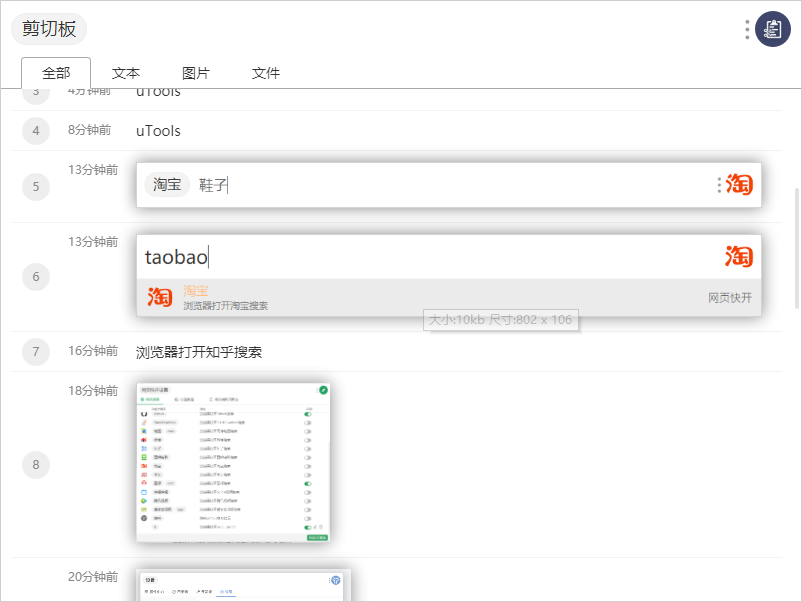
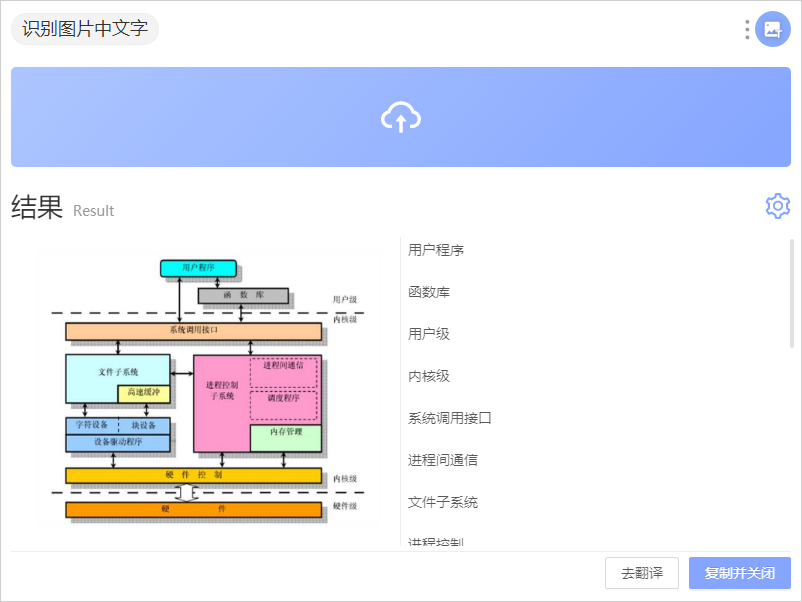
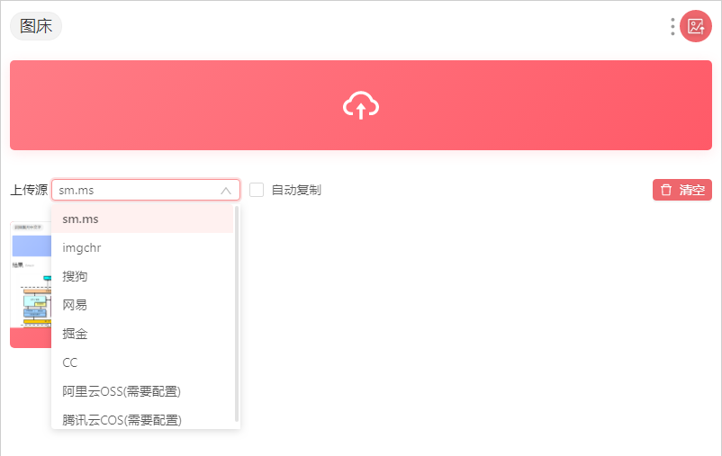
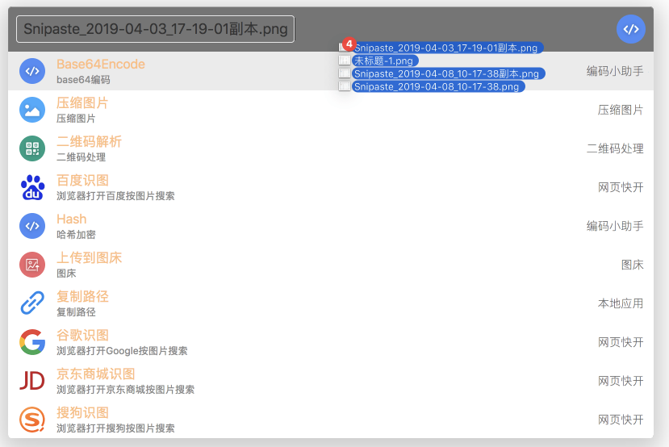
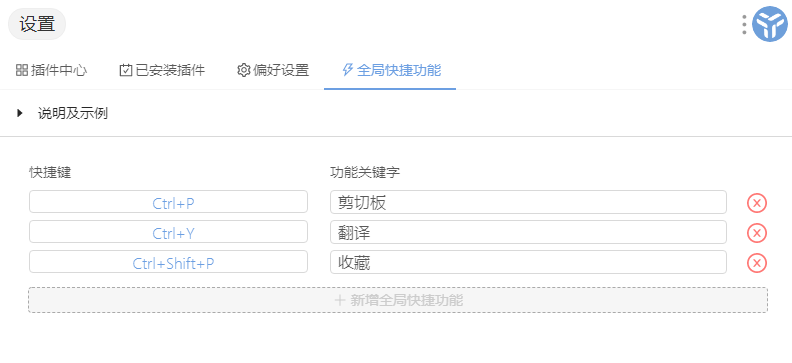

# uTools

> uTools是一个 `极简、插件化、跨平台` 的现代桌面软件。通过自由选配丰富的插件，打造你得心应手的工具集合。
>
> 当你熟悉它后，能够为你节约大量时间，让你可以更加专注地改变世界。

uTools 是以一个全局快捷输入框为入口的插件平台，同类型的工具有  

- windows 下的 **WOX**
- macOS 下的 **alfred**

## 特性

- **插件化：** 优秀的插件化设计，自取所需。每个插件解决一个具体场景的问题，简洁易用、随用随走。
- **多功能输入框：** 支持文本、截图、图片、文件、文件夹
- **自动识别：** 自动识别文本类型（json、base64、时间戳等）
- **自动粘贴：** 呼出uTools时，如果剪切板中5秒内有新的内容，将自动粘贴到输入框
- **全局快捷键：** 配合插件，可一键上传截图到图床、以图搜图、翻译剪贴板内容等
- **数据同步：** 云端同步，永不丢失

uTools 是跨平台的，并且可以通过登录账号实现同步配置，这样更有利于节省多个场景办公的配置成本

## 下载安装

- **uTools windows版（64位）** [下载](https://download.u-tools.cn/windows/64)
- **uTools windows版（32位）** [下载](https://download.u-tools.cn/windows/32)
- **uTools Mac版** [下载](https://download.u-tools.cn/mac)

# 快速启动

你可以快速打开本地应用程序，控制面板内的各项设置等。

强大的快速启动，比你想象的更加深入。对中文语义的友好支持，首字母检索等。

## 网页快开

打开网页快开的设置项，启用需要使用的网页功能

比如：要 **搜索淘宝网的鞋子**，输入  `taobao` 后，按下空格或回车，再输入 `鞋子` ，按下回车 即打开浏览器 搜索淘宝网鞋子

# 插件中心

## 插件功能示例

### 翻译

### 剪切板

**剪切板** 不仅支持文本，还支持图片和文件

###  收藏

收藏功能可以保存一些常用的文本信息，比如 **身份证号码，手机号，邮箱，常用命令 **等

通过 唤起后输入 **收藏别名** 就可以快速复制，这样就又快又不易出错？

### OCR

OCR 可以识别图片中的文字，通过复制或者上传图片都可以识别，贼好用

### 图床

图床功能能选择多个保存地址，通过 复制和上传 都可以实现，非常方便

# 自动识别

uTools支持多种输入源呼出插件，例如：**字符输入、文件拖拽、截图粘贴**，亦能够自动识别输入内容进入相应插件，如 json、时间戳、base64 等。

# 数据同步

uTools各插件产生的数据将保存到本地数据库中。为了便于在不同设备之间共享数据，或是预防重装系统造成数据丢失，我们提供云端数据备份同步服务，登录后可一键开启。

全局快捷键的设置在熟练使用后可以快速启动相应插件

# 更多

还有更多的插件，需要小伙伴们自行探索了，这个工具在快速开发中，未来会有越来越多的插件加入进来

想要了解 uTools 更多，请移步 [官网](https://www.u.tools//) ，在使用中遇到问题也可以通过 [社区](https://yuanliao.info/) 寻求帮助

更多优秀工具，请 **关注微信公众号** 获取

