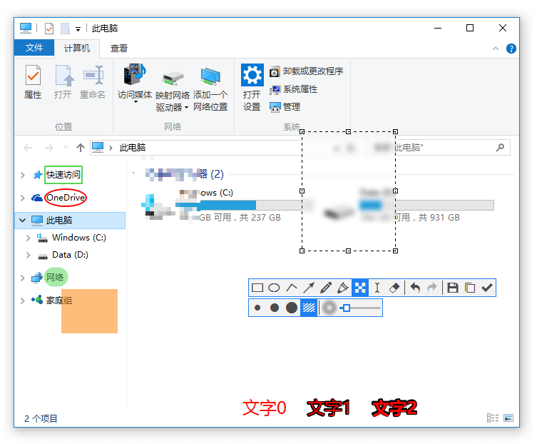

# Snipaste

`免费` `安全` ` 无广告` `功能强大` 
> Snipaste 是一个简单但强大的截图工具，也可以让你将截图贴回到屏幕上！下载并打开 按下 F1 来开始截图，再按 F3，截图就在桌面置顶显示了。就这么简单！

你还可以将剪贴板里的**文字或者颜色信息转化为图片窗口**，并且将它们进行**缩放、旋转、翻转、设为半透明**，甚至让鼠标能穿透它们！
如果你是程序员、设计师，或者是大部分工作时间都在电脑前，**贴图功能**将改变你的工作方式、提升工作效率。

通过阅读 [用户手册](https://docs.snipaste.com/#/zh-cn/) 可以了解 Snipaste 的高级的用法，进一步提升你的工作效率。

#  下载安装

Snipaste  是跨平台应用，支持 windows，macOS，Linux（正在开发）

- windows 
  - 从 [微软应用商店](https://www.microsoft.com/store/apps/9p1wxpkb68kx?cid=snipaste) 获取 
  - 前往官网下载最新版 https://zh.snipaste.com/
- macOS 可以通过 `brew cask install snipaste` 快速安装

# 强大的截图

- 自动检测界面元素区域
- 像素级的鼠标移动控制（W A S D)、截图范围控制
- **取色器** (试试 `F1`, `C`, `F3`)，可按下 Shift 来切换颜色格式 
- **历史记录回放** (进入截图后，按 `,`/`.`)
- 支持多屏 支持高分屏

## 历史记录回放

# 标注图像

- 丰富的画图工具  `矩形，椭圆，线条，箭头，铅笔，马克笔，文字`
- 高级标注工具 `马赛克，高斯模糊，橡皮擦`
- 撤销、重做

# 贴图

> 请正确理解 **贴**图 ：大部分情况下，贴图是将系统剪贴板中的内容转化成图片，然后作为窗口置顶显示。 
>
> 所以，能否贴出来、贴出来的是什么，取决于系统剪贴板中的内容。

通过  `快捷键（默认 F3）\ 鼠标中键单击托盘图标 \ 截图时选择贴到屏幕`   均可实现 **贴图**。

# 自定义设置

- 主题色、界面字体、通知栏图标等
- 快捷键
- 丰富的功能性选项

# 快捷键

## [只对截图有效](https://docs.snipaste.com/zh-cn/key-bindings?id=只对截图有效)

| 按键            | 命令                                   |
| --------------- | -------------------------------------- |
| Tab             | 切换检测窗口/检测界面元素              |
| ` 或 !          | 显示/隐藏捕获的鼠标指针                |
| Ctrl + A        | 设置截屏区域为全屏                     |
| R               | 将截屏区域设置为上一次成功截图时的区域 |
| ,               | 切换到上一次截屏记录                   |
| .               | 切换到下一次截屏记录                   |
| Ctrl + ↑ ← ↓ →  | 将截屏区域相应边界扩大 1 像素          |
| Shift + ↑ ← ↓ → | 将截屏区域相应边界缩小 1 像素          |
| Ctrl + T        | 直接将截图贴到屏幕                     |
| Enter           | 复制截图并退出截屏                     |
| Esc             | 中止截屏                               |
| 鼠标右键单击    | 重新设置截屏区域/中止截屏              |

## [只对贴图有效](https://docs.snipaste.com/zh-cn/key-bindings?id=只对贴图有效)

| 按键             | 命令                                     |
| ---------------- | ---------------------------------------- |
| 1                | 将贴图顺时针旋转 90 度                   |
| 2                | 将贴图逆时针旋转 90 度                   |
| 3                | 水平翻转贴图                             |
| 4                | 垂直翻转贴图                             |
| 5                | 切换灰度显示 [PRO]                       |
| Esc              | 隐藏标注工具条或关闭贴图窗口             |
| Shift + Esc      | 销毁贴图窗口                             |
| Ctrl + Shift + C | 复制纯文本（如果该贴图是由文本转换而来） |
| Ctrl + V         | 以剪贴板中的内容替换该贴图               |
| Ctrl + Shift + P | 打开首选项对话框                         |

## [通用](https://docs.snipaste.com/zh-cn/key-bindings?id=通用)

| 按键             | 命令                                         |
| ---------------- | -------------------------------------------- |
| Alt              | 显示放大镜                                   |
| Shift            | 放大镜可见时，切换颜色格式                   |
| C                | 放大镜可见时，复制颜色值                     |
| W S A D          | 将鼠标指针移动 1 像素                        |
| ↑ ← ↓ →          | 非编辑状态下, 将截屏区域/贴图窗口移动 1 像素 |
| 空格键           | 显示/隐藏标注工具条                          |
| Ctrl + Z         | 撤销上一次标注（可以再恢复）                 |
| Ctrl + Shift + Z | 移除所有标注（无法再恢复）                   |
| Ctrl + C         | 复制图像                                     |
| Ctrl + Y         | 恢复下一个标注                               |
| Ctrl + S         | 将图像保存为文件                             |
| Ctrl + Shift + S | 保存图像到快速保存目录                       |
| Ctrl + P         | 发送图像到打印机                             |
| 鼠标右键单击     | 结束对当前标注的编辑                         |
| 鼠标滚轮 或 1/2  | 调整画笔粗细（编辑模式时）                   |

# 更多

想要了解 Snipaste  更多，请移步 [官网](https://zh.snipaste.com/) ，在使用中遇到问题也可以通过 [github](https://github.com/Snipaste/feedback/) 对项目提出 issue 

更多优秀工具，请**关注微信公众号**获取

