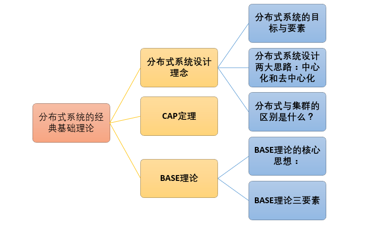

来至 [https://github.com/Snailclimb/JavaGuide](https://github.com/Snailclimb/JavaGuide)

# 基础
## Java基础
- 父类的私有属性和构造方法并不能被继承，所以构造方法不能被重写
- String 类中使用 final 关键字修饰 char[] 来保存字符串，所以不可变
- StringBuffer(同步)和StringBuilder也是用 char[] ，但是没用final
- 抽象是对类的抽象，是一种模板设计，而接口是对行为的抽象，是一种行为的规范
## == 与 equals
* == : 判断两个对象的地址是不是相等。即:判断两个对象是不是同一个对象
  (基本数据类型==比较的是值，引用数据类型==比较的是内存地址)。
* equals() : 它的作用也是判断两个对象是否相等。但它一般有两种使用情况：
  1 类没有覆写 equals() 方法。则通过 equals() 比较该类的两个对象时，等价于 ==
  2 类覆写了 equals() 方法。一般，我们都覆盖 equals() 方法来比较两个对象的内容是否相等；
   若它们的内容相等，则返回 true (即，认为这两个对象相等)。
## hashCode
* hashCode() 的作用是获取哈希码（或 散列码）；它实际上是返回一个int整数。是确定该对象在哈希表中的索引位置。Java中的任何类都包含有hashCode() 函数。
  **散列表**存储的是键值对(key-value)，它的特点是：能根据“键”快速的检索出对应的“值”。这其中就利用到了**散列码**
  hashCode() 在散列表中才有用，在其它情况下没用
  对象可能被放入哈希表作为key时，重写equals方法，一定要**重写hashCode**方法。
### hashCode（）与equals（）的相关规定
* 如果两个对象相等，则hashcode一定也是相同的
* 两个对象相等,对两个对象分别调用equals方法都返回true
* 两个对象有相同的hashcode值，它们也不一定是相等的
* 因此，equals 方法被覆盖过，则 hashCode 方法也必须被覆盖
  hashCode() 的默认行为是对堆上的对象产生独特值。如果没有重写 hashCode()，则该 class 的两个对象无论如何都不会相等（即使这两个对象指向相同的数据）

HashSet 放入新的对象A，会判断是否已存在，判断过程会先获取对象A的hashCode，如果HashSet中相应的hashCode目标位置已存在对象B，则执行对象A和对象B的equal，不相同就添加。这样大大减少了 equals 的次数（equals整个表的对象）
## Exception


## 关键字
### static
- 修饰成员变量和成员方法 静态变量
- 静态代码块
- 修饰类(只能修饰内部类)  不能使用任何外围类的非static成员变量和方法
- 静态导包(用来导入类中的静态资源，1.5之后的新特性)
  执行顺序： 静态代码块—非静态代码块—构造方法
### final
- 修饰类 类不能被继承。final类中的所有成员方法都会被隐式地指定为final方法。
- 修饰方法 1. 继承类不能复写；2. 早期的Java实现版本性能提升，类中的private方法都隐式地指定为final。
- 修饰变量 1. 基础变量 初始化不再变更，2. 对象 指向后不能修改
### transient
阻止实例中那些用此关键字修饰的的变量序列化；当对象被反序列化时，被transient修饰的变量值不会被持久化和恢复。transient只能修饰变量，不能修饰类和方法。

## volatile
一旦一个共享变量（类的成员变量、类的静态成员变量）被volatile修饰之后，这个变量是不稳定的，每次使用它都到主存中进行读取，那么就具备了两层语义：

1. 保证了不同线程对这个变量进行操作时的可见性，即一个线程修改了某个变量的值，这新值对其他线程来说是立即可见的。
2. 禁止进行指令重排序。

volatile只能保证可见性，无法保证原子性

## 流


- BIO 同步阻塞I/O模式
- NIO 同步非阻塞的I/O模型 提供了与传统BIO模型中的 Socket 和 ServerSocket 相对应的 SocketChannel 和 ServerSocketChannel 两种不同的套接字通道实现
- AIO(NIO2) 异步非阻塞的IO模型，异步 IO 是基于事件和回调机制实现的
  对于低负载、低并发的应用程序，可以使用同步阻塞I/O来提升开发速率和更好的维护性；
  对于高负载、高并发的（网络）应用，应使用 NIO 的非阻塞模式来开发
## Java Web
转发是服务器行为，重定向是客户端行为。
Cookie 数据保存在客户端(浏览器端)，Session 数据保存在服务器端。

# 容器
## ArrayList 与 LinkedList 区别
1. 都是不同步的，线程不安全
2. Arraylist底层为**对象数组**，LinkedList为双向链表数据结构
3. ArrayList 支持 **快速随机访问**，LinkedList 不支持
4. ArrayList 的空间浪费体现在列表的结尾会预留一定的容量空间，LinkedList 体现在它的每一个元素（存放直接后继和直接前驱）都需要消耗比 ArrayList 更多的空间

## RandomAccess 
随机访问接口是空实现，仅是一个标识，在 **binarySearch** 方法中，如果支持 RandomAccess 接口就调用indexedBinarySearch（二分查找，如果是无序的需要传入比较器Comparator），
否则用iteratorBinarySearch（迭代遍历）

## Vector
Vector 所有方法都是同步的
## ArrayList 扩容
ArrayList 无参构造时容量为10，之后 add 超出容量时变为原先的 1.5 倍（为15）
ArrayList#ensureCapacity() 为扩容，在 add 大量元素之前用 ensureCapacity 方法，以减少增量重新分配的次数

## HashMap
hash%length==hash&(length-1) 的前提是 length 是2的 n 次方）
采用二进制位操作 &，相对于%能够提高运算效率

多线程下使用 HashMap 还是会存在其他问题比如数据丢失。
并发环境下推荐使用 **ConcurrentHashMap**

### 扩容

当元素个数超过数组大小 **loadFactor** 时，就会进行数组扩容，loadFactor的 **默认值为 0.75**，也就是，默认情况下，数组大小为16，那么当元素个数超过 16 \* 0.75=12 的时候，就把数组的大小扩展为 2\* 16=32，即扩大一倍，然后重新计算每个元素在数组中的位置，而这是一个非常消耗性能的操作，所以如果我们已经预知元素的个数，那么预设元素的个数能够有效的提高hashmap的性能。

比如说，我们预计要放入 1000 个元素，要使用 **new HashMap(2048)** ，因为 2048不仅是2的次幂，而且 2048*0.75 > 1000 不需要扩容resize了

### HashMap 和 Hashtable
1 HashMap 是非线程安全的，HashTable 是线程安全的
2 HashMap 中 null 可以作为键，这样的键只有一个，HashTable 不允许key为 null
3 HashMap 默认的初始化大小为16。之后每次扩充 容量变为原来的2倍，Hashtable 默认的初始大小为11，之后每次扩充，容量变为原来的2n+1。
4 JDK1.8 以后的 HashMap 在解决哈希冲突时有了较大的变化，当链表长度大于阈值（默认为8）时，将链表转化为红黑树，以减少搜索时间。Hashtable 没有这样的机制。
在同步上，Hashtable 使用同一把锁 synchronized 性能很差，**ConcurrentHashMap** 基于HashMap 红黑树 ，synchronized 和 CAS（比较替换）性能更佳。

### LinkHashMap

底层还是hashmap，但是加入元素后，会将 hashmap 的元素用双向链表串起来，输出的顺序和输入的相同，LRU 算法应用

# 并发
### 并发基础
**进程**是操作系统**分配资源**的最小单元，**线程**是操作系统**调度**的最小单元
> 协程，英文Coroutines，是一种比线程更加轻量级的存在。协程是是由程序所控制（也就是在用户态执行）应线程阻塞提出的回调恢复上下文。


堆和方法区是所有线程共享的资源，其中堆是进程中最大的一块内存，主要用于存放新创建的对象 (所有对象都在这里分配内存)，方法区主要用于存放已被加载的类信息、常量、静态变量、即时编译器编译后的代码等数据。
### 避免死锁
- 破坏互斥条件
- 破坏请求与保持条件 一次性申请所有的资源。
- 破坏不剥夺条件 占用部分资源的线程进一步申请其他资源时，如果申请不到，可以主动释放它占有的资源。
- 破坏循环等待条件 靠按序申请资源来预防。按某一顺序申请资源，释放资源则反序释放。破坏循环等待条件。
### sleep和 wait 区别和共同点
sleep 方法没有释放锁，而 wait 方法释放了锁 。
两者都可以暂停线程的执行。
Wait 通常被用于线程间交互/通信，sleep 通常被用于暂停执行。
wait() 方法被调用后，线程不会自动苏醒，需要别的线程调用同一个对象上的 notify() 或者 notifyAll() 方法。
sleep() 方法执行完成后，线程会自动苏醒。

### 为什么我们不能直接调用 run() 方法

new 一个 Thread，线程进入了新建状态;调用 start() 方法，会启动一个线程并使线程进入了就绪状态，当分配到时间片后就可以开始运行了。 

**start() 会执行线程的相应准备工作，然后自动执行 run() 方法的内容，这是真正的多线程工作。**

而直接执行 run() 方法，会把 run 方法当成一个 main 线程下的普通方法去执行，并不会在某个线程中执行它，所以这并不是多线程工作。
总结： 调用 start 方法方可启动线程并使线程进入就绪状态，而 run 方法只是 thread 的一个普通方法调用，还是在主线程里执行。

## 并发进阶
### synchronized
synchronized关键字解决的是多个线程之间访问资源的同步性，synchronized关键字可以保证被它修饰的方法或者代码块在任意时刻只能有一个线程执行。
#### synchronized 使用方式
1. 修饰实例方法: 作用于当前对象实例加锁，进入同步代码前要获得当前对象实例的锁
2. 修饰静态方法: 也就是给当前类加锁，会作用于**类的所有对象实例**，因为静态成员不属于任何一个实例对象，是类成员。所以如果一个线程A调用一个实例对象的非静态 synchronized 方法，而线程B需要调用这个实例对象所属类的静态 synchronized 方法，是允许的，不会发生互斥现象，因为访问静态 synchronized 方法占用的锁是当前类的锁，而访问非静态 synchronized 方法占用的锁是当前实例对象锁。
3. 修饰代码块: 指定加锁对象，对给定对象加锁，进入同步代码库前要获得给定对象的锁。
    总结：synchronized 关键字加到 static 静态方法和 synchronized(class)代码块上都是是给 Class 类上锁。synchronized 关键字加到实例方法上是给对象实例上锁。
    尽量不要使用 synchronized(String a) 因为JVM中，字符串常量池具有缓存功能！

```java
public class Singleton {
    /* volatile 是必要的，因为JVM会指令重排 使123变成132 多线程下会导致出错，
    1. 分配内存空间  2. 初始化对象  3. 执行分配的空间
    */
    private volatile static Singleton uniqueInstance;

    private Singleton() {
    }

    public static Singleton getUniqueInstance() {
       //先判断对象是否已经实例过，没有实例化过才进入加锁代码
        if (uniqueInstance == null) {
            // 类对象加锁
            synchronized (Singleton.class) {
                if (uniqueInstance == null) {
                    uniqueInstance = new Singleton();
                }
            }
        }
        return uniqueInstance;
    }
}
```

### volatile
一旦一个共享变量（类的成员变量、类的静态成员变量）被volatile修饰之后，这个变量是不稳定的，每次使用它都到主存中进行读取，那么就具备了两层语义：

1. 保证了不同线程对这个变量进行操作时的可见性，即一个线程修改了某个变量的值，这新值对其他线程来说是立即可见的。
2. 禁止进行指令重排序。

### synchronized和ReentrantLock 的区别
- 两者都是**可重入锁**（自己可以再次获取自己的内部锁）。
- synchronized **依赖于 JVM** 而 ReentrantLock **依赖于 API**（需要lock, unlock）
- 相比synchronized 增加了一些高级功能
 - **等待可中断**  lock.lockInterruptibly()，正在等待的线程可以选择放弃等待，改为处理其他事情。
 - **可实现公平锁**  ReentrantLock可以指定是**公平锁**（先等待的线程先获得锁）还是非公平锁。而synchronized只能是非公平锁。
 - **可实现选择性通知**（锁可以绑定多个条件）ReentrantLock类结合Condition实例可以实现“选择性通知”。而synchronized关键字就相当于整个Lock对象中只有一个Condition实例，所有的线程都注册在它一个身上。如果执行notifyAll()方法的话就会通知所有处于等待状态的线程这样会造成很大的效率问题，而Condition实例的signalAll()方法 只会唤醒注册在该Condition实例中的所有等待线程。

## volatile
### 内存模式
当前的 Java 内存模型下，线程可以把变量保存本地内存比如机器的寄存器中，而不是直接在主存中进行读写。这就可能造成一个线程在主存中修改了一个变量的值，而另外一个线程还继续使用它在寄存器中的变量值的拷贝，造成数据的不一致。


把变量声明为volatile，这就指示 JVM，这个变量是不稳定的，每次使用它都到主存中进行读取。

### synchronized和volatile比较
* **volatile关键字是线程同步的轻量级实现**，volatile性能比synchronized关键字要好。但是**volatile关键字只能用于变量**而synchronized关键字可以修饰方法以及代码块。synchronized关键字在JavaSE1.6之后进行了主要包括为了减少获得锁和释放锁带来的性能消耗而引入的偏向锁和轻量级锁以及其它各种优化之后执行效率有了显著提升，实际开发中使用 synchronized 关键字的场景还是更多一些。
* 多线程访问 volatile 关键字不会发生阻塞，而 synchronized 关键字可能会发生阻塞
* volatile关键字能保证数据的**可见性**，但**不能保证数据的原子性**。synchronized关键字**两者都能保证**。
* volatile关键字主要用于解决**变量在多个线程之间的可见性**，而 synchronized关键字解决的是多个线程之间**访问资源的同步性**。

### ThreadLocal
### 线程池
- **降低资源消耗。** 通过重复利用已创建的线程降低线程创建和销毁造成的消耗。
- **提高响应速度。** 当任务到达时，任务可以不需要的等到线程创建就能立即执行。
- **提高线程的可管理性。** 线程是稀缺资源，如果无限制的创建，不仅会消耗系统资源，还会降低系统的稳定性，使用线程池可以进行统一的分配，调优和监控。
  执行差别
  **`execute()` 方法用于提交不需要返回值的任务，所以无法判断任务是否被线程池执行成功与否；**
  **`submit()` 方法用于提交需要返回值的任务。线程池会返回一个Future类型的对象，通过这个Future对象可以判断任务是否执行成功**，并且可以通过future的get()方法来获取返回值，get()方法会阻塞当前线程直到任务完成，而使用 `get（long timeout，TimeUnit unit）`方法则会阻塞当前线程一段时间后立即返回，这时候有可能任务没有执行完。

### 拒绝策略

- ThreadPoolExecutor.AbortPolicy:丢弃任务并抛出RejectedExecutionException异常。
- ThreadPoolExecutor.DiscardPolicy：丢弃任务，但是不抛出异常。
- ThreadPoolExecutor.DiscardOldestPolicy：丢弃队列最前面的任务，然后重新提交被拒绝的任务
- ThreadPoolExecutor.CallerRunsPolicy：由调用线程（提交任务的线程）处理该任务

### 原子类 
原子类是指一个操作是不可中断的。即使是在多个线程一起执行的时候，一个操作一旦开始，就不会被其他线程干扰。 
如: AtomicLongArray  AtomicLong
AtomicInteger 类主要利用 CAS (compare and swap) + volatile 和 native 方法来保证原子操作，从而避免 synchronized 的高开销，执行效率大为提升。
**CAS** 有名的无锁算法，无锁编程。原理是拿内存上的值和原本取时候的旧值作比较，如果相同（意味着没被其他线程改过）则更新成新的值。一般情况下是一个自旋操作，即**不断的重试**。

## AQS 
AbstractQueuedSynchronizer 核心思想是，如果被请求的共享资源空闲，则将当前请求资源的线程设置为有效的工作线程，并且将共享资源设置为锁定状态。如果被请求的共享资源被占用，那么就需要一套线程阻塞等待以及被唤醒时锁分配的机制，这个机制AQS是用CLH队列锁实现的，即将暂时获取不到锁的线程加入到队列中。
CLH(Craig,Landin,and Hagersten)队列是一个虚拟的双向队列（虚拟的双向队列即不存在队列实例，仅存在结点之间的关联关系）。AQS是将每条请求共享资源的线程封装成一个CLH锁队列的一个结点（Node）来实现锁的分配。
AQS使用一个int成员变量来表示同步状态，通过内置的FIFO队列来完成获取资源线程的排队工作。AQS使用CAS对该同步状态进行原子操作实现对其值的修改。

> TODO 很懵逼 【AQS】

## 并发容器
- **ConcurrentHashMap:** 线程安全的HashMap
- **CopyOnWriteArrayList:** 线程安全的List，在读多写少的场合性能非常好，远远好于Vector. 原理是 复制一份出来，写入新的内容，再修改指针指向。仅在 多线程写时加锁
- **ConcurrentLinkedQueue:** 高效的并发队列，使用链表实现。可以看做一个线程安全的 LinkedList，这是一个非阻塞队列。使用 CAS 非阻塞算法来实现线程安全
- **BlockingQueue:** 这是一个接口，JDK内部通过链表、数组等方式实现了这个接口。表示阻塞队列，非常适合用于作为数据共享的通道。
- **ConcurrentSkipListMap:** 跳表的实现。这是一个Map，使用跳表的数据结构进行快速查找。
> TODO 有空研究下

## 悲观锁与乐观锁 
* **悲观锁** 每次去拿数据的时候都认为别人会修改，所以每次在拿数据的时候都会上锁。
  传统的关系型数据库里边就用到了很多这种锁机制
  比如行锁，表锁等，读锁，写锁等，都是在做操作之前先上锁。
  Java中synchronized和ReentrantLock等独占锁就是悲观锁思想的实现。
* **乐观锁** 每次去拿数据的时候都认为别人不会修改，所以不会上锁，但是在更新的时候会判断一下在此期间别人有没有去更新这个数据，可以使用版本号机制和CAS算法实现。
  乐观锁适用于多读的应用类型，这样可以提高吞吐量，像数据库提供的类似于write_condition机制，其实都是提供的乐观锁。
  在Java中java.util.concurrent.atomic包下面的**原子变量类**就是使用了乐观锁的一种实现方式CAS实现的。

乐观锁 使用版本号机制和CAS算法实现：
1. 版本号机制：在数据表中加上一个数据版本号version字段，修改写入时比较读取时的值，相同意味着没有其他线程修改过。
2. CAS算法：compare and swap（比较与交换）
    悲观锁适用于多写，乐观锁适用于多读

简单的来说CAS适用于写比较少的情况下（多读场景，冲突一般较少），synchronized适用于写比较多的情况下（多写场景，冲突一般较多）
synchronized在线程冲突较少的情况下，可以获得和CAS类似的性能；而线程冲突严重的情况下，性能远高于CAS。

#   JVM 虚拟机

## 内存区域


### 程序计数器
可以看作是当前线程所执行的字节码的行号指示器，
1 字节码解释器工作时通过改变这个计数器的值来选取下一条需要执行的字节码指令
2 为了线程能切换上下文，每条线程都需要有一个独立的程序计数器

### Java 虚拟机栈
Java 虚拟机栈是由一个个栈帧组成，而每个栈帧中都拥有：局部变量表、操作数栈、动态链接、方法出口信息。
Java 方法有两种返回方式：
1 return 语句
2 抛出异常

 - StackOverFlowError 线程请求栈的深度大于虚拟机所允许的栈深度
 - OutOfMemoryError 虚拟机在扩展时无法申请到足够的内存空间
    不管哪种返回方式都会导致栈帧被弹出

### 本地方法栈
虚拟机栈为虚拟机执行 Java 方法 （也就是字节码）服务，而本地方法栈则为虚拟机使用到的 Native 方法服务。在 HotSpot 虚拟机中和 Java 虚拟机栈合二为一。

### 堆
Java 堆是所有线程共享的一块内存区域，在虚拟机启动时创建。此内存区域的唯一目的就是存放对象实例，几乎所有的对象实例以及数组都在这里分配内存。
Java 堆是垃圾收集器管理的主要区域，因此也被称作GC 堆（Garbage Collected Heap）
现在收集器基本都采用
**分代垃圾收集算法** 即：划分代使用不同的垃圾收集算法，新生代大批被回收选用**复制算法**，老年代存活率高使用**标记-清理**回收

### 方法区
用于存储已被虚拟机加载的类信息、常量、静态变量、即时编译器编译后的代码等数据，方法区也被称为**永久代**。
方法区和永久代的关系很像 Java 中接口和类的关系，类实现了接口，而永久代就是 HotSpot 虚拟机对虚拟机规范中方法区的一种实现方式
JDK 1.8 的时候，方法区（HotSpot 的永久代）被彻底移除了，取而代之是元空间，元空间使用的是直接内存。

### 运行时常量池
运行时常量池是方法区的一部分。Class 文件中除了有类的版本、字段、方法、接口等描述信息外，还有常量池信息（用于存放编译期生成的各种字面量和符号引用）
JDK1.7 及之后版本的 JVM 已经将运行时常量池从方法区中移了出来，在 Java 堆（Heap）中开辟了一块区域存放运行时常量池。

### 直接内存
直接内存并不是虚拟机运行时数据区的一部分，也不是虚拟机规范中定义的内存区域，但是这部分内存也被频繁地使用。而且也可能导致 OutOfMemoryError 异常出现。
JDK1.4 中新加入的 NIO(New Input/Output) 类，引入了一种基于通道（Channel） 与缓存区（Buffer） 的 I/O 方式，它可以直接使用 Native 函数库直接分配堆外内存，然后通过一个存储在 Java 堆中的 DirectByteBuffer 对象作为这块内存的引用进行操作。这样就能在一些场景中显著提高性能，因为避免了在 Java 堆和 Native 堆之间来回复制数据。

本机直接内存的分配不会受到 Java 堆的限制，但是，既然是内存就会受到本机总内存大小以及处理器寻址空间的限制

## 虚拟机对象对象处理
### 对象创建
1. **类加载检查**：虚拟机遇到一条 new 指令时，首先将去检查这个指令的参数是否能在常量池中定位到这个类的符号引用，并且检查这个符号引用代表的类是否已被加载过、解析和初始化过。如果没有，那必须先执行相应的类加载过程。
2. **分配内存**： 虚拟机将为新生对象分配内存。对象所需的内存大小在类加载完成后便可确定，为对象分配空间的任务等同于把一块确定大小的内存从 Java 堆中划分出来。分配方式有 **“指针碰撞”** 和 **“空闲列表”** 两种， 
    - 指针碰撞 内存没有碎片的，分配时移动指针（指向是否分配的临界点）就可以
    - 空闲列表 内存有碎片，列表里记录着哪里碎片区间能用

  Java 堆是否规整由所采用的垃圾收集器是否带有压缩整理功能决定，取决于 GC 收集器的算法是"**标记-清除**"，还是"**标记-整理**"（也称作"**标记-压缩**"），值得注意的是，复制算法内存也是规整的

3. **初始化零值**
     虚拟机需要将分配到的内存空间都初始化为零值（不包括对象头），保证了对象的成员变量有默认值。

4. **设置对象头**
     虚拟机对对象进行必要的设置，例如：这个对象是哪个类的实例、如何才能找到 类的元数据信息、哈希码、对象的GC 分代年龄等信息。 这些信息存放在对象头中。
     另外，根据虚拟机当前运行状态的不同，如是否启用偏向锁等，对象头会有不同的设置方式。
5. **执行 init 方法**
     接着执行 <init> 方法，把对象按照程序员的意愿进行初始化，这样一个真正可用的对象才算完全产生出来。

#### 内存分配并发问题
虚拟机必须要保证线程是安全的，虚拟机采用两种方式来保证线程安全：
- **CAS+失败重试**: 冲突失败就重试，直到成功为止
- **TLAB**: 为每一个线程预先在 Eden 区分配一块儿内存，为对象分配内存时，首先在 TLAB 分配，当对象大于 TLAB 中的剩余内存或 TLAB 的内存已用尽时，再采用上述的 CAS 进行内存分配

### 对象的内存布局
分为 3 块区域：**对象头、实例数据和对齐填充**
- 对象头 包含哈希码、GC 分代年龄、锁状态标志等以及类元数据指针（标识它是什么类）
- 实例数据 程序中所定义的各种类型的字段内容。
- 不是必然存在的，用来占位的（因为对象的大小必须是 8 byte的整数倍）

### 对象的访问定位
①使用句柄 和 ②直接指针
使用句柄隔了一层，对象被移动时只会改变句柄中的实例数据指针

### 常量池解惑
#### String
**只要使用 new 方法，便需要创建新的对象**
使用双引号声明出来的 String 对象会存储在常量池中。
String.intern() 返回常量池中字符串的引用（没有就创建）
String s1 = new String("abc");  将创建 1 或 2 个字符串。如果池中已存在字符串文字“abc”，

#### 基础类型包装类
Byte, Short, Integer, Long, Character, Boolean；这 5 种包装类默认创建了数值[-128，127] 的相应类型的缓存数据，但是超出此范围仍然会去创建新的对象。
两种浮点数类型的包装类 Float, Double 并没有实现常量池技术。
因为+这个操作符不适用于 Integer 对象，如果 Integer 使用了 + 就会自动拆箱 

## JVM 垃圾回收

上图所示的 eden 区、s0("From") 区、s1("To") 区都属于新生代，tentired 区属于老年代。
每一次垃圾回收都会使年龄+1，达到默认15时进入老年代（可通过 -XX:MaxTenuringThreshold  设置）
1.  对象在Eden区分配
2.  第一次新时代垃圾回收后，存活则进入s1(To)，年龄+1
3.  回收后eden和s0已经被清空，s0和s1交换角色，保证s1区域都是空的
4.  重复2，3直到 s1被填满，就将所有对象移到 tentired

**新生代 GC（Minor GC）**: Minor GC 非常频繁，回收速度一般也比较快。
**老年代 GC（Major GC/Full GC）**: 出现了 Major GC 经常会伴随至少一次的 Minor GC，速度一般会比 Minor GC 的慢 10 倍以上。
**分配担保机制** Minor GC后还是没有足够的内存，就将新生代的对象放入老年代腾出空间（如果老年代的空间放不下新对象，则执行Full GC）
大对象直接进入老年代（避免Minor GC降低效率）
年龄大（默认15）的进入老年代
**动态年龄判定** 如果s0, s1相同年龄所有对象大小总和大于总空间一半，则全部放入老年代

### 对象死亡


- 引用计数法：当有一个地方引用它，计数器 +1，引用失效，计数器 -1，但存在循环引用问题，所以并不采用
- 可达性分析算法：以 “GC Roots” 的对象为起点，向下搜索，记录可达对象，遍历完不可达的对象为不可用对象（比如它们聚在角落）

**引用**
- 强引用：大部分引用都是强引用，垃圾回收器不会回收它（宁可OOM）
- 软引用（SoftReference）：内存不够回收
- 弱引用（WeakReference）： 被看到就回收，生命周期比软引用短
- 虚引用（PhantomReference）： 在任何时候都可能被垃圾回收
> 懵逼中... 【引用】

**如何判断一个类是无用的类**： 1 所有实例被回收   2 该类ClassLoader被回收 3 该类对应的 java.lang.Class 对象没有被引用，无法通过反射访问该类的方法。

### 垃圾回收算法
- **标记-清除算法**：标记出所有需要回收的对象，在标记完成后统一回收被标记的对象，但清除后存在不连续的碎片
- **标记-清理算法**：标记出存活的对象，让存活的向一端移动，清理掉端边界以外的内存
- **复制算法**：它可以将内存**分为大小相同的两块**，每次使用其中的一块。当这一块的内存使用完后，就将还存活的对象复制到另一块去，然后再把使用的空间一次清理掉
  分代收集算法： **新生代使用 复制算法，老年代使用 标记-清除 或 标记-整理**
## JDK 监控 【JDK监控】
## 类文件结构 【类文件结构】
## 类加载  【类加载】
# I/O 【I/O】
## NIO
NIO 包含下面几个核心的组件：
- Channel(通道)
- Buffer(缓冲区)
- Selector(选择器)
  JDK 原生 NIO 不易实现，有 bug
  Netty 的出现很大程度上改善了 JDK 原生 NIO 所存在的问题
# Java8
[java8简明教程](https://www.jianshu.com/p/dacfe1886e83)
# 网络相关
## 一次web交互过程 TODO
## 为什么要三次握手
1 第一次握手：Client 什么都不能确认；Server 确认了对方发送正常
2 第二次握手：Client 确认了：自己发送、接收正常，对方发送、接收正常；Server 确认了：自己接收正常，对方发送正常
3 第三次握手：Client 确认了：自己发送、接收正常，对方发送、接收正常；Server 确认了：自己发送、接收正常，对方发送、接收正常

所以三次握手就能确认双发收发功能都正常，缺一不可。
## 为什么要四次挥手
任何一方都可以在数据传送结束后发出连接释放的通知，待对方确认后进入半关闭状态。当另一方也没有数据再发送的时候，则发出连接释放通知，对方确认后就完全关闭了TCP连接。

举个例子：A 和 B 打电话，通话即将结束后，A 说“我没啥要说的了”，B回答“我知道了”，但是 B 可能还会有要说的话，A 不能要求 B 跟着自己的节奏结束通话，于是 B 可能又巴拉巴拉说了一通，最后 B 说“我说完了”，A 回答“知道了”，这样通话才算结束。

## 其他
[其他名词](https://github.com/Snailclimb/JavaGuide/blob/master/docs/network/%E5%B9%B2%E8%B4%A7%EF%BC%9A%E8%AE%A1%E7%AE%97%E6%9C%BA%E7%BD%91%E7%BB%9C%E7%9F%A5%E8%AF%86%E6%80%BB%E7%BB%93.md)
# Linux
压缩是仅针对一个文件的行为，打包是把多个文件转换成一个文件，
tar 是打包文件后缀， .tar.gz 是用 gzip压缩过的 tar 文件
```
z：调用gzip压缩命令进行压缩
c：打包文件
v：显示运行过程
f：指定文件名
tar -zcvf test.tar.gz /test/
//  解压到当前目录下
tar -xvf test.tar.gz
// 解压到/usr目录下  -C 指定位置
tar -xvf xxx.tar.gz -C /usr
```
ps -ef/ps -aux  查看正在运行进程

# 数据结构
## Set
Set 是一个不允许出现重复元素，并且无序的集合，主要 HashSet 和 TreeSet 两大实现类。

1. **HashSet** 是哈希表结构，利用 HashMap 的 key 来存储元素，计算插入元素的 hashCode 来获取元素在集合中的位置；
2.  **TreeSet** 是红黑树结构，每一个元素都是树中的一个节点，插入的元素都会进行排序；

## 树
### 二叉树
* **完全二叉树** 若设二叉树的高度为h，除第 h 层外，其它各层 (1～h-1) 的结点数都达到最大个数，第h层有叶子结点，并且叶子结点都是从左到右依次排布（最后一层从左到右排没排满）
* **满二叉树** 除了叶结点外每一个结点都有左右子叶 **且** 叶子结点都处在最底层的二叉树。（完整排满）
* **平衡二叉树** 一棵空树或它的左右两个子树的高度差的绝对值不超过1，并且左右两个子树都是一棵平衡二叉树。（具有自调整算法，让自己子树高度差小于1，加快查找）
* **二叉查找树**：
  1 若任意节点的左子树不空，则左子树上所有结点的 值均小于它的根结点的值；
  2 若任意节点的右子树不空，则右子树上所有结点的值均大于它的根结点的值；
  3 任意节点的左、右子树也分别为二叉查找树；
  4 没有键值相等的节点（no duplicate nodes）。
* **红黑树** 是为了解决二叉查找树的缺陷，因为二叉查找树在某些情况下会退化成一个线性结构（插入比树中元素小的值，整个树就一直往左边生长）
  1 每个节点非红即黑；
  2 根节点总是黑色的；
  3 每个叶子节点都是黑色的空节点（NIL节点）；
  4 如果节点是红色的，则它的子节点必须是黑色的（反之不一定）；
  5 从根节点到叶节点或空子节点的每条路径，必须包含相同数目的黑色节点（即相同的黑色高度）。
  红黑树通过 **变色，左旋，右旋** 来实现自平衡 [漫画：什么是红黑树？]([https://juejin.im/post/5a27c6946fb9a04509096248](https://juejin.im/post/5a27c6946fb9a04509096248)
  )
* B-树（或B树）是一种平衡的多路查找（又称排序）树，在文件系统中有所应用。主要用作文件的索引。其中的B就表示平衡(Balance) 

   1. B+ 树的叶子节点链表结构相比于 B- 树便于扫库，和范围检索。 

   2. B+ 树支持**range-query（区间查询）**非常方便，而B树不支持。**这是数据库选用B+树的最主要原因**  

   3. B* 树 是B+树的变体，B*树分配新结点的概率比B+树要低，空间使用率更高； 
# 算法
# Mysql
[一千行MySQL命令.md](https://github.com/Snailclimb/JavaGuide/blob/master/docs/database/%E4%B8%80%E5%8D%83%E8%A1%8CMySQL%E5%91%BD%E4%BB%A4.md)
TODO

# Redis
[Redis](https://github.com/Snailclimb/JavaGuide/blob/master/docs/database/Redis/Redis.md)
redis 就是一个存在内存的数据库，可用作分布式锁，支持事务 、持久化、LUA脚本、LRU驱动事件、多种集群方案。

## 缓存
使用 redis 做缓存，可以
1. 提高性能（不访问数据库，从内存中直接拿值），
2. 提高并发，部分请求不询问数据库了。


缓存分为**本地缓存**和**分布式缓存**
- 本地缓存（如Java中自己实现的 map）轻量快速，生命周期跟随 jvm 。
- 分布式缓存（如 redis，memcached）缓存具有一致性，但架构复杂

对于写操作，应先操作数据库，再删除缓存，避免高并发时出现不一致

## 过期时间
可以设置key的过期时间，通过 **定期删除（每隔100ms随机抽取删除）**和**惰性删除**（不释放内存） 实现删除
### 淘汰机制
1 volatile-lru：从已设置过期时间的数据集（server.db[i].expires）中挑选最近最少使用的数据淘汰
2 volatile-ttl：从已设置过期时间的数据集中挑选将要过期的数据淘汰
3 volatile-random：从已设置过期时间的数据集中任意选择数据淘汰
4 allkeys-lru：当内存不足以容纳新写入数据时，在键空间中，移除最近最少使用的key（这个是最常用的）
5 allkeys-random：从数据集（server.db[i].dict）中任意选择数据淘汰
6 no-eviction：禁止驱逐数据，也就是说当内存不足以容纳新写入数据时，新写入操作会报错。
7 volatile-lfu：从已设置过期时间的数据集中挑选最不经常使用的数据淘汰
8 allkeys-lfu：当内存不足以容纳新写入数据时，在键空间中，移除最不经常使用的key

## 持久化
Redis支持两种不同的持久化操作
- **快照（snapshotting)** ：redis 默认使用，创建快照副本（可以备份，建立主从结构）
```
save 900 1           #在900秒(15分钟)之后，如果至少有1个key发生变化，Redis就会自动触发BGSAVE命令创建快照。
save 300 10          #在300秒(5分钟)之后，如果至少有10个key发生变化，Redis就会自动触发BGSAVE命令创建快照。
save 60 10000        #在60秒(1分钟)之后，如果至少有10000个key发生变化，Redis就会自动触发BGSAVE命令创建快照。
```
- **AOF持久化（AOF）** 可以配置（appendonly yes）开启，默认不开启，AOF 实时写入硬盘的AOF文件
```
appendfsync always    #每次有数据修改发生时都会写入AOF文件,这样会严重降低Redis的速度
appendfsync everysec  #每秒钟同步一次，显示地将多个写命令同步到硬盘
appendfsync no        #让操作系统决定何时进行同步
```
Redis 4.0 开始支持 RDB 和 AOF 的混合持久化，AOF 重写的时候就直接把 RDB 的内容写到 AOF 文件开头
## redis 事务
一个支持事务（Transaction）的数据库，必须要具有这四种特性  ACID
- 原子性（Atomicity）：执行要么全部完成，要么全不完成，执行过程如果出错会回滚到开始阶段，就像没发生一样
- 一致性（Consistency）：如果事务是并发多个，系统也必须如同串行事务一样操作
- 隔离性（Isolation）：确保每一事务在系统中认为只有该事务在使用系统。这种属性有时称为串行化
- 持久性（Durability）：在事务完成以后，该事务对数据库所作的更改便持久的保存在数据库之中，并不会被回滚。
## 缓存雪崩和缓存穿透
* 雪崩：缓存同一时间大面积的失效，请求都落到数据库上，数据库短时间内承受大量请求而崩掉。
   - 事前 集群高可用，发现宕机就补上
   - 事中 本地ehcache缓存 + hystrix限流&降级
   - 事后 利用 redis 持久化机制保存的数据尽快恢复缓存
* 穿透：故意去请求缓存中不存在的数据，请求都落到数据库上，数据库短时间内承受大量请求而崩掉。
   - 布隆过滤器 将所有可能存在的数据哈希到一个足够大的bitmap中，不存在的 key 拦截掉
   - 把不存在的空值也写入缓存（但过期时间短，避免这个key突然有值了）
* 缓存击穿：指一个key非常热点，在不停的扛着大并发，大并发集中对这一个点进行访问，当这个key在失效的瞬间，持续的大并发就穿破缓存，直接请求数据库。
## 并发竞争 key
指多个系统同时对一个 key 进行操作，但是最后执行的顺序和我们期望的顺序不同
解决：使用 **分布式锁**（zookeeper 和 redis 都可以实现分布式锁），基于zookeeper临时有序节点

## 保证缓存和数据库双写数据一致性
读请求和写请求串行化，串到一个内存队列里去，这样就可以保证一定不会出现不一致的情况

串行化之后，就会导致系统的吞吐量会大幅度的降低，用比正常情况下多几倍的机器去支撑线上的一个请求
## 单线程的redis为什么这么快
redis 使用**多路复用**
这里“多路”指 多个网络连接，“复用”指 复用同一个线程
TODO
Reactor设计模式：处理一个或多个客户端并发请求服务的事件设计模式。当请求抵达后，服务处理程序使用I/O多路复用策略，然后同步地派发这些请求至相关的请求处理程序。
## RedLock
TODO


# 设计模式
# Spring
Spring 官网列出的 Spring 的 6 个特征:

**核心技术** ：依赖注入(DI)，AOP，事件(events)，资源，i18n，验证，数据绑定，类型转换，SpEL。
**测试** ：模拟对象，TestContext框架，Spring MVC 测试，WebTestClient。
**数据访问** ：事务，DAO支持，JDBC，ORM，编组XML。
**Web支持** ：Spring MVC和Spring WebFlux Web框架。
**集成** ：远程处理，JMS，JCA，JMX，电子邮件，任务，调度，缓存。
**语言** ：Kotlin，Groovy，动态语言。

## IoC
IoC（Inverse of Control:控制反转）是一种设计思想，是将原本在程序中手动创建对象的控制权，交由Spring框架来管理。
Spring 时代我们一般通过 XML 文件来配置 Bean，SpringBoot 使用注解配置

## AOP
AOP(Aspect-Oriented Programming:面向切面编程)能够将那些与业务无关，却为业务模块所共同调用的逻辑或责任（例如**事务处理、日志管理、权限控制等**）封装起来，便于**减少系统的重复代码，降低模块间的耦合度，并有利于未来的可拓展性和可维护性**

Spring AOP就是基于**动态代理**的，如果要代理的对象，实现了某个接口，那么Spring AOP会使用JDK Proxy，去创建代理对象（**动态代理只能代理接口**）
而对于没有实现接口的对象，就无法使用 JDK Proxy 去进行代理了，这时候Spring AOP会使用**Cglib** ，使用 Cglib 生成一个被代理对象的子类来作为代理

当然你也可以使用 AspectJ, Spring AOP 已经集成了AspectJ ，AspectJ 应该算的上是 Java 生态系统中最完整的 AOP 框架了。
- Spring AOP 属于**运行时增强**，基于 **动态代理**，简单
- AspectJ 是**编译时增强**，基于 **字节码操作**，功能强大

Spring注意到AspectJ在AOP的实现方式上依赖于特殊编译器(ajc编译器)，因此Spring很机智回避了这点，转向采用动态代理技术的实现原理来构建Spring AOP的内部机制（动态织入），这是与AspectJ（静态织入）最根本的区别。Spring 只是使用了与 AspectJ 5 一样的注解，但仍然没有使用 AspectJ 的编译器，底层依是动态代理技术的实现，因此并不依赖于 AspectJ 的编译器。 Spring AOP虽然是使用了那一套注解，其实实现AOP的底层是使用了动态代理(JDK或者CGLib)来动态植入。

## Bean TODO
### Spring 中的 bean 生命周期 TODO
### Spring 中的 bean 的作用域 TODO
## SpringMVC


1. 客户端（浏览器）发送请求，直接请求到 `DispatcherServlet`。
2. `DispatcherServlet` 根据请求信息调用 `HandlerMapping`，解析请求对应的 `Handler`。
3. 解析到对应的 `Handler`（也就是我们平常说的 `Controller` 控制器）后，开始由 `HandlerAdapter` 适配器处理。
4. `HandlerAdapter` 会根据 `Handler `来调用真正的处理器开处理请求，并处理相应的业务逻辑。
5. 处理器处理完业务后，会返回一个 `ModelAndView` 对象，`Model` 是返回的数据对象，`View` 是个逻辑上的 `View`。
6. `ViewResolver` 会根据逻辑 `View` 查找实际的 `View`。
7. `DispaterServlet` 把返回的 `Model` 传给 `View`（视图渲染）。
8. 把 `View` 返回给请求者（浏览器）

## Spring 用到的设计模式
- **工厂设计模式**:  Spring使用工厂模式通过 `BeanFactory`、`ApplicationContext` 创建 bean 对象。
- **代理设计模式**: Spring AOP 功能的实现。
- **单例设计模式**: Spring 中的 Bean 默认都是单例的。
- **模板方法模式**: Spring 中 `jdbcTemplate`、`hibernateTemplate` 等以 Template 结尾的对数据库操作的类，它们就使用到了模板模式。
- **包装器设计模式**: 我们的项目需要连接多个数据库，而且不同的客户在每次访问中根据需要会去访问不同的数据库。这种模式让我们可以根据客户的需求能够动态切换不同的数据源。
- **观察者模式**: Spring 事件驱动模型就是观察者模式很经典的一个应用。
- **适配器模式**: Spring AOP 的增强或通知(Advice)使用到了适配器模式、spring MVC 中也是用到了适配器模式适配`Controller`。
- ......

## @Component 和 @Bean 的区别是什么？

1. 作用对象不同: `@Component` 注解作用于类，而`@Bean`注解作用于方法。
2. `@Component`通常是通过类路径扫描来自动侦测以及自动装配到Spring容器中（我们可以使用 `@ComponentScan` 注解定义要扫描的路径从中找出标识了需要装配的类自动装配到 Spring 的 bean 容器中）。
    `@Bean` 注解通常是我们在标有该注解的方法中定义产生这个 bean, `@Bean`告诉了Spring这是某个类的示例，当我需要用它的时候给我。
3. `@Bean` 注解比 `Component` 注解的自定义性更强，而且很多地方我们只能通过 `@Bean` 注解来注册bean。比如当我们引用第三方库中的类需要装配到 `Spring`容器时，则只能通过 `@Bean`来实现。

我们一般使用 `@Autowired` 注解自动装配 bean，要想把类标识成可用于 `@Autowired` 注解自动装配的 bean 的类,采用以下注解可实现：

- `@Component` ：通用的注解，可标注任意类为 `Spring` 组件。如果一个Bean不知道属于拿个层，可以使用`@Component` 注解标注。
- `@Repository`: 对应持久层即 Dao 层，主要用于数据库相关操作。
- `@Service`: 对应服务层，主要涉及一些复杂的逻辑，需要用到 Dao层。
- `@Controller`: 对应 Spring MVC 控制层，主要用户接受用户请求并调用 Service 层返回数据给前端页面。

## Spring事务 TODO
# ZooKeeper TODO
# 数据通讯
## RESTful
## 消息队列
使用消息队列主要是为了通过异步处理提高系统性能和**削峰、降低系统耦合性**。
队列 Queue 是一种先进先出的数据结构，所以消费消息时也是按照顺序来消费的
### 削峰
- 不使用消息队列时，高并发写入，数据库压力大响应慢
- 使用后，交由消息队列异步写入，高并发立即返回，因为是异步写入，所以业务场景中不能直接告知结果（比如抢xiaomi的时候要过好久才告诉你抢到没）
### 降低系统耦合性
**EDA事件驱动架构**：EDA是一种以事件为媒介，实现组件或服务之间最大松耦合的方式。传统面向接口编程是以接口为媒介，实现调用接口者和接口实现者之间的解耦，但是这种解耦程度不是很高，如果接口发生变化，双方代码都需要变动，而事件驱动则是调用者和被调用者互相不知道对方，两者只和中间消息队列耦合。

消息发送者将消息发送至分布式消息队列即结束对消息的处理，消息接受者从分布式消息队列获取该消息后进行后续处理，并不需要知道该消息从何而来。
对新增业务，只要对该类消息感兴趣，即可订阅该消息，对原有系统和业务没有任何影响，从而实现网站业务的**可扩展性设计**。

另外为了避免消息队列服务器宕机造成消息丢失，会将成功发送到消息队列的消息存储在消息生产者服务器上，等消息真正被消费者服务器处理后才删除消息。在消息队列服务器宕机后，生产者服务器会选择分布式消息队列服务器集群中的其他服务器发布消息。

### 带来的问题
- **系统可用性降低**：消息可能丢失，消息队列宕机
- **系统复杂性提高**：重复消费，消息传递顺序
- **一致性问题**：没正确消费
### JMS VS AMQP
**JMS**（JAVA Message Service，Java消息服务）API是一个消息服务的标准或者说是规范。ActiveMQ 就是基于 JMS 规范实现的。
**AMQP** (Advanced Message Queuing Protocol)一个提供统一消息服务的应用层标准。高级消息队列协议（二进制应用层协议），为面向消息的中间件设计，兼容 JMS

## RabbitMQ 入门 TODO
# 网络架构
## 分布式

- 分布式存储：将数据分散存储在多台独立的设备上
- 分布式计算：是一门计算机科学，它研究如何把一个需要非常巨大的计算能力才能解决的问题分成许多小的部分，然后把这些部分分配给许多计算机进行处理，最后把这些计算结果综合起来得到最终的结果
  -分布式网络存储技术：是将数据分散的存储于多台独立的机器设备上。分布式网络存储系统采用可扩展的系统结构，利用多台存储服务器分担存储负荷，利用位置服务器定位存储信息，不但解决了传统集中式存储系统中单存储服务器的瓶颈问题，还提高了系统的可靠性、可用性和扩展性。
### CAP
- **一致性（Consistence）**：所有节点访问同一份最新的数据副本
- **可用性（Availability）**：每次请求都能获取到非错的响应——但是不保证获取的数据为最新数据
- **分区容错性（Partition tolerance）**：分布式系统在遇到某节点或网络分区故障的时候，仍然能够对外提供满足一致性和可用性的服务。
  当发生网络分区的时候，如果我们要继续服务，那么强一致性和可用性只能2选1。也就是说当网络分区之后P是前提，决定了P之后才有C和A的选择。也就是说分区容错性（Partition tolerance）我们是必须要实现的。

### BASE
BASE理论是对CAP理论的延伸，核心思想是即使无法做到强一致性（Strong Consistency，CAP的一致性就是强一致性），但应用可以采用适合的方式达到最终一致性（Eventual Consitency）。BASE是指基本可用（Basically Available）、软状态（ Soft State）、最终一致性（ Eventual Consistency）
1. **基本可用：** 基本可用是指分布式系统在出现不可预知故障的时候，允许损失部分可用性。但是，这绝不等价于系统不可用。 比如： **①响应时间上的损失**:正常情况下，一个在线搜索引擎需要在0.5秒之内返回给用户相应的查询结果，但由于出现故障，查询结果的响应时间增加了1~2秒；**②系统功能上的损失**：正常情况下，在一个电子商务网站上进行购物的时候，消费者几乎能够顺利完成每一笔订单，但是在一些节日大促购物高峰的时候，由于消费者的购物行为激增，为了保护购物系统的稳定性，部分消费者可能会被引导到一个降级页面；
2. **软状态：** 软状态指允许系统中的数据存在中间状态，并认为该中间状态的存在不会影响系统的整体可用性，即允许系统在不同节点的数据副本之间进行数据同步的过程存在延时；
3. **最终一致性：** 最终一致性强调的是系统中所有的数据副本，在经过一段时间的同步后，最终能够达到一个一致的状态。因此，最终一致性的本质是需要系统保证最终数据能够达到一致，而不需要实时保证系统数据的强一致性。
### 分布式事务
分布式事务就是指事务的参与者、支持事务的服务器、资源服务器以及事务管理器分别位于不同的分布式系统的不同节点之上。以上是百度百科的解释，简单的说，就是一次大的操作由不同的小操作组成，这些小的操作分布在不同的服务器上，且属于不同的应用，分布式事务需要保证这些小操作要么全部成功，要么全部失败。本质上来说，分布式事务就是为了保证不同数据库的数据一致性。
### 分布式系统一致性 TODO
## 大型网络技术架构 TODO
## 网络技术架构理解 TODO
# 工具
## Git
## Docker