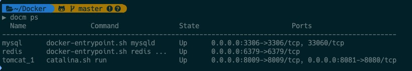

> Docker 是一个开源的应用容器引擎，基于 [Go 语言](https://www.runoob.com/go/go-tutorial.html) 并遵从Apache2.0协议开源。
>
> Docker 可以让开发者打包他们的应用以及依赖包到一个轻量级、可移植的容器中，然后发布到任何流行的 Linux 机器上，也可以实现虚拟化。
>
> 容器是完全使用沙箱机制，相互之间不会有任何接口（类似 iPhone 的 app）, 更重要的是容器性能开销极低。

[Docker 官网](https://www.docker.com/)

# Docker

```shell
# install
wget -qO- https://get.docker.com/ | sh
# start
sudo service docker start
# hello world
docker run hello-world
```

正常的话显示

```shell
Unable to find image 'hello-world:latest' locally
latest: Pulling from library/hello-world
1b930d010525: Pull complete
Digest: sha256:2557e3c07ed1e38f26e389462d03ed943586f744621577a99efb77324b0fe535
Status: Downloaded newer image for hello-world:latest

Hello from Docker!
This message shows that your installation appears to be working correctly.

To generate this message, Docker took the following steps:
 1. The Docker client contacted the Docker daemon.
 2. The Docker daemon pulled the "hello-world" image from the Docker Hub.
    (amd64)
 3. The Docker daemon created a new container from that image which runs the
    executable that produces the output you are currently reading.
 4. The Docker daemon streamed that output to the Docker client, which sent it
    to your terminal.

To try something more ambitious, you can run an Ubuntu container with:
 $ docker run -it ubuntu bash

Share images, automate workflows, and more with a free Docker ID:
 https://hub.docker.com/

For more examples and ideas, visit:
 https://docs.docker.com/get-started/
```

## 运行一个web应用

```
# docker pull training/webapp  # 载入镜像
# docker run -it --name py_webapp -p 777:5000 training/webapp python app.py
```


# 常用命令
```
# 查看容器状态
docker ps -a 
# 查看容器日志
docker logs CONTAINER_ID
```


# Docker-Compose
> Compose 项目是 Docker 官方的开源项目，负责实现对 Docker 容器集群的快速编排。Compose 定位是 「定义和运行多个 Docker 容器的应用（Defining and running multicontainer Docker applications）」

```shell
# pip3 如果不存在就先按照pip3
apt install python3-pip
# install
pip3 install -U docker-compose
```
安装完成后，在本地新建编辑一个** docker-compose.yml**，在里面编写特定规则的配置项，通过 **up** 命令，就可以依次下载运行配置项中的镜像了
```
docker-compose up
```
**[docker-compose.yml  一键部署后端运行环境]**

```dockerfile
version: "3.7"
services:
  mysql:
    container_name: mysql
    image: mysql:latest                            #从私有仓库拉镜像
    restart: always                    
    volumes:
      - ./mysql/data/:/var/lib/mysql/
      - ./mysql/mysql-files:/var/lib/mysql-files/   
      - ./mysql/cnf/:/etc/mysql/                          #映射mysql的数据目录到宿主机，保存数据
      - ./mysql/mysqld.cnf:/etc/mysql/mysql.conf.d/mysqld.cnf #把mysql的配置文件映射到容器的相应目录
    ports:
      - "3306:3306"
    environment:
      - MYSQL_ROOT_PASSWORD=ROOT
  nginx:
    container_name: nginx
    image: nginx:latest
    restart: always
    ports:
      - 80:80
      - 443:443
      - 5050:5050
      - 4040:4040
    volumes:
      - ./webserver:/webserver
      - ./nginx/conf/nginx.conf:/etc/nginx/nginx.conf            #映射nginx的配置文件到容器里
      - ./nginx/logs/:/var/log/nginx/
      - ./nginx/data/:/var/share/nginx/html/                     #映射nginx的网页目录到容器里
    links:
      - tomcat                                               #连接 tomcat镜像
  tomcat:
    container_name: tomcat
    image: tomcat:latest
    restart: always
    ports:
      - 8080:8080
      - 8009:8009
    volumes:
      - ./tomcat/webapps/web:/usr/local/tomcat/webapps/web          #映射一个web服务
      - ./tomcat/conf/server.xml:/usr/local/tomcat/conf/server.xml  #映射 tomcat的配置文件到容器里
      - ./tomcat/logs/:/usr/local/tomcat/logs/
    links:
      - mysql                                                   #连接数据库镜像

  redis:
    # 指定镜像
    image: redis
    ports:
      # 端口映射
      - 6379:6379
    volumes:
      # 目录映射
      - ./redis/conf:/usr/local/etc/redis
      - ./redis/data:/data
    command:
      # 执行的命令
      redis-server

```

> 注意目录挂载中的文件挂载。如果不存在该文件，docker-compose 是会把它当成目录去创建，如：/nginx/conf/nginx.conf，需要手动 创建这个配置文件，而且不是仅仅创建就完了，还需要对他进行正确的配置
>
> 笔者也觉得很麻烦，所以是通过一个git仓库去管理这些文件的，每次部署（可能几年就一次）新的设备时，就 pull 下来 直接 docm up 就可以了


在实际开发中，这个 **docker-compose** 太长了，可以通过配置别名 **alias** 把它改短一些，笔者用的是docm
```shell
alias docm="docker-compose"
```



# 打包容器到Docker hub
1. 去[ https://hub.docker.com]( https://hub.docker.com) 新建一个 repository

2. `docker login` 登录账号

3. 运行 `docker ps` 查看当前容器 id

  

4. 创建一个提交生成镜像 `docker commit CONTAINER_ID Name`
    

5. push 刚才的镜像到远程仓库
     

6. 正常的使用镜像
```dockerfile
version: "3.7"
services:
  mysql_cchao:
    container_name: mysql_cchao
    image: cchao1024/mysql:latest                          #从私有仓库拉镜像
    restart: always                    
    volumes:
      - ./mysql/data/:/var/lib/mysql/                             #映射mysql的数据目录到宿主机，保存数据
      - ./mysql/conf/mysqld.cnf:/etc/mysql/mysql.conf.d/mysqld.cnf
    ports:
      - "3307:3307"
    environment:
      - MYSQL_ROOT_PASSWORD=ROOT
```